# Wiki Documentation for https://github.com/FyodorovAI/fyodorov-llm-agents

Generated on: 2025-05-20 16:15:38

## Table of Contents

- [Introduction](#overview-introduction)
- [Getting Started](#overview-getting-started)
- [Architecture Overview](#architecture-overview)
- [Data Flow](#architecture-data-flow)
- [Agent Creation](#features-agent-creation)
- [Tool Integration](#features-tool-integration)
- [Function Calling](#features-function-calling)
- [Database Schema](#data-management-database-schema)
- [Agent Service](#backend-agent-service)
- [Tool Service](#backend-tool-service)
- [LLM Models](#model-integration-llms)
- [LiteLLM Integration](#model-integration-litellm)

<a id='overview-introduction'></a>

## Introduction

<details>
<summary>Relevant source files</summary>

The following files were used as context for generating this wiki page:

- [src/fyodorov_llm_agents/agents/agent_service.py](src/fyodorov_llm_agents/agents/agent_service.py)
- [src/fyodorov_llm_agents/tools/tool.py](src/fyodorov_llm_agents/tools/tool.py)
- [src/fyodorov_llm_agents/tools/mcp_tool_model.py](src/fyodorov_llm_agents/tools/mcp_tool_model.py)
- [src/fyodorov_llm_agents/agents/agent_model.py](src/fyodorov_llm_agents/agents/agent_model.py)
- [src/fyodorov_llm_agents/instances/instance_service.py](src/fyodorov_llm_agents/instances/instance_service.py)
- [src/fyodorov_llm_agents/models/llm_model.py](src/fyodorov_llm_agents/models/llm_model.py)
</details>

# Introduction

This wiki page provides an overview of the agent system within the `fyodorov-llm-agents` repository. The agent system is responsible for handling interactions with language models, managing tools, and orchestrating complex workflows. It encompasses the creation, configuration, and execution of agents that can leverage various tools and models to perform specific tasks. The core components involve agent models, agent services for execution, and integration with external tools via defined APIs. [Instance Service](#instance-service) manages the chat history and agent calls.

## Agent Model

The `Agent` class in `agent_model.py` defines the structure and validation rules for an agent. It includes attributes like name, description, prompt, associated tools, and model configurations. The agent model serves as a blueprint for creating and configuring agents within the system. [Tool integration](#tool-integration) is a key feature, allowing agents to use external tools.

### Agent Attributes

The `Agent` model includes several key attributes:

*   **id:** Unique identifier for the agent.
*   **created\_at:** Timestamp indicating when the agent was created.
*   **api\_key:** API key for accessing external services.
*   **api\_url:** URL for accessing external APIs.
*   **tools:** List of tool names associated with the agent.
*   **rag:** List of configurations for Retrieval-Augmented Generation.
*   **model:** LLM model associated with the agent.
*   **provider:** Provider for the LLM model.
*   **name:** Name of the agent.
*   **description:** Description of the agent.
*   **prompt:** Prompt used to guide the agent's behavior.
*   **prompt\_size:** Maximum size of the prompt.
*   **public:** Flag indicating whether the agent is public.

Sources: [src/fyodorov_llm_agents/agents/agent_model.py:9-32]()

### Agent Validation

The `Agent` model includes validation methods to ensure data integrity. These methods check the validity of the agent's name, description, and prompt.

*   `validate_name`: Checks if the name is not empty, does not exceed the maximum length, and contains only valid characters.
*   `validate_description`: Checks if the description is not empty and does not exceed the maximum length.
*   `validate_prompt`: Checks if the prompt does not exceed the maximum allowed size.

Sources: [src/fyodorov_llm_agents/agents/agent_model.py:48-64]()

### Agent Model Mermaid Diagram

```mermaid
graph TD
    A[Agent Model] --> B(id: Optional[int])
    A --> C(created_at: Optional[datetime])
    A --> D(api_key: str | None)
    A --> E(api_url: HttpUrl | None)
    A --> F(tools: list[str])
    A --> G(rag: list[dict])
    A --> H(model: LLMModel | None)
    A --> I(provider: ProviderModel | None)
    A --> J(name: str)
    A --> K(description: str)
    A --> L(prompt: str)
    A --> M(prompt_size: int)
    A --> N(public: bool | None)
```

This diagram illustrates the structure of the `Agent` model and its attributes. Sources: [src/fyodorov_llm_agents/agents/agent_model.py:9-32]()

## Agent Service

The `Agent` class in `agent_service.py` provides methods for interacting with language models, including calling the model with function calling capabilities. It handles the construction of messages, tool retrieval, and response processing.

### Calling LLM with Tools

The `call_with_fn_calling` method orchestrates the interaction with the language model, incorporating tools for enhanced functionality.

1.  **Message Construction:** Creates a list of messages including the system prompt, chat history, and user input.
2.  **Tool Retrieval:** Fetches the specified tools based on their names and user ID.
3.  **LLM Completion:** Calls the `litellm.completion` method to get a response from the language model, potentially using the provided tools.
4.  **Response Processing:** Parses the response, handles tool calls, and returns the final answer.

Sources: [src/fyodorov_llm_agents/agents/agent_service.py:12-64]()

### Agent Service Sequence Diagram

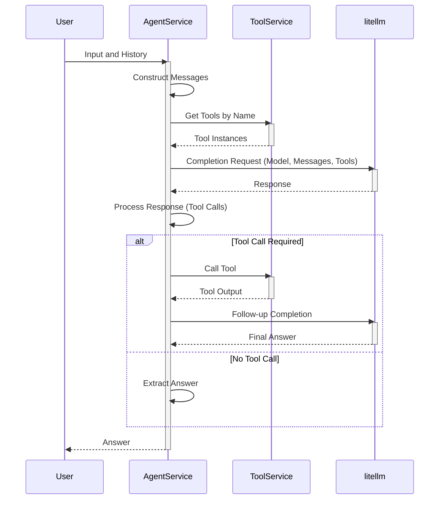

This diagram shows the sequence of interactions within the `AgentService`, including tool retrieval and LLM completion. Sources: [src/fyodorov_llm_agents/agents/agent_service.py:12-64]()

## Tool Integration

The `Tool` class in `tool.py` represents an external tool that can be used by agents. It defines the structure, validation, and API specification for tools. The `MCPTool` in `mcp_tool_model.py` represents a tool stored in the database, including its capabilities and authentication information.

### Tool Attributes

The `Tool` model includes attributes such as:

*   **name:** Name of the tool.
*   **name\_for\_ai:** Name of the tool for AI interaction.
*   **description:** Description of the tool.
*   **description\_for\_ai:** Description of the tool for AI interaction.
*   **api\_type:** Type of the API (e.g., "openapi").
*   **api\_url:** URL of the API.
*   **logo\_url:** URL of the tool's logo.
*   **contact\_email:** Contact email for the tool.
*   **legal\_info\_url:** URL for legal information about the tool.

Sources: [src/fyodorov_llm_agents/tools/tool.py:15-25]()

The `MCPTool` model includes attributes such as:

*   **id:** Unique identifier for the tool.
*   **name:** Name of the tool.
*   **handle:** Handle for the tool.
*   **description:** Description of the tool.
*   **logo\_url:** URL of the tool's logo.
*   **user\_id:** User ID associated with the tool.
*   **public:** Flag indicating whether the tool is public.
*   **api\_type:** Type of the API.
*   **api\_url:** URL of the API.
*   **auth\_method:** Authentication method for the tool.
*   **auth\_info:** Authentication information for the tool.
*   **capabilities:** Capabilities of the tool, including function definitions.
*   **health\_status:** Health status of the tool.
*   **usage\_notes:** Usage notes for the tool.

Sources: [src/fyodorov_llm_agents/tools/mcp_tool_model.py:11-30]()

### Tool API Specification

The `get_api_spec` method in the `Tool` class fetches the API specification from the specified URL. It supports both JSON and YAML formats. This specification is used to generate function definitions for the tool. Sources: [src/fyodorov_llm_agents/tools/tool.py:52-61]()

### Tool Function Definition

The `get_function` method in both `Tool` and `MCPTool` classes converts the tool's API specification or capabilities into a function definition that can be used by language models. This definition includes the function name, description, and parameters. Sources: [src/fyodorov_llm_agents/tools/tool.py:72-81](), [src/fyodorov_llm_agents/tools/mcp_tool_model.py:79-85]()

### MCP Tool Call

The `call` method in the `MCPTool` class executes the tool's API with the provided arguments. It handles authentication, constructs the request, and processes the response. Sources: [src/fyodorov_llm_agents/tools/mcp_tool_model.py:87-117]()

### Tool Class Diagram

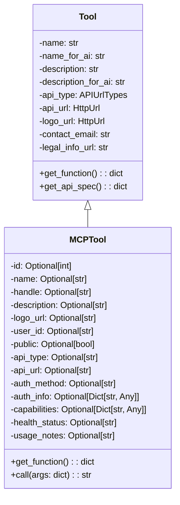

This diagram shows the relationship between the `Tool` and `MCPTool` classes. Sources: [src/fyodorov_llm_agents/tools/tool.py](), [src/fyodorov_llm_agents/tools/mcp_tool_model.py]()

## Instance Service

The `Instance` class in `instance_service.py` manages chat instances, including their history and associated agents. It provides methods for initiating and managing conversations with agents.

### Chat with Function Calls

The `chat_w_fn_calls` method initiates a chat with an agent, leveraging function calling capabilities.

1.  **Agent Retrieval:** Fetches the agent based on the instance's agent ID.
2.  **Tool Retrieval:** Retrieves the tools associated with the agent.
3.  **Agent Call:** Calls the `call_with_fn_calling` method in the `Agent` service to get a response from the language model.
4.  **History Update:** Updates the chat history with the user input and agent response.

Sources: [src/fyodorov_llm_agents/instances/instance_service.py:25-43]()

### Instance Service Sequence Diagram

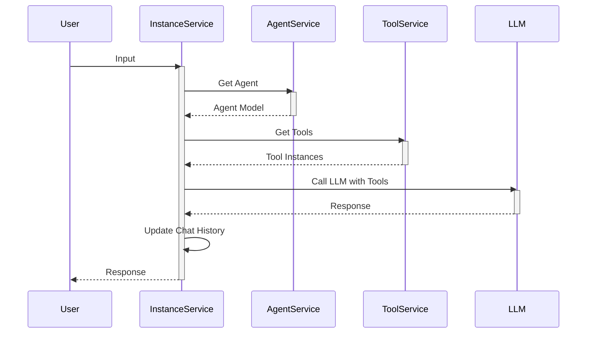

This diagram illustrates the sequence of interactions within the `InstanceService`, including agent and tool retrieval, and LLM calls. Sources: [src/fyodorov_llm_agents/instances/instance_service.py:25-43]()

## Conclusion

The agent system provides a flexible and extensible framework for building intelligent agents that can leverage language models and external tools. The `Agent` model defines the structure and validation rules for agents, while the `Agent` service handles the execution of agents and interaction with language models. Tool integration allows agents to access external services and perform complex tasks. The `Instance` service manages chat instances and their associated agents, providing a complete solution for building conversational AI applications.


---

<a id='overview-getting-started'></a>

## Getting Started

<details>
<summary>Relevant source files</summary>

The following files were used as context for generating this wiki page:

- [src/fyodorov_llm_agents/requirements.txt](src/fyodorov_llm_agents/requirements.txt)
- [src/fyodorov_llm_agents/agents/agent_service.py](src/fyodorov_llm_agents/agents/agent_service.py)
- [src/fyodorov_llm_agents/tools/tool.py](src/fyodorov_llm_agents/tools/tool.py)
- [src/fyodorov_llm_agents/tools/mcp_tool_model.py](src/fyodorov_llm_agents/tools/mcp_tool_model.py)
- [src/fyodorov_llm_agents/agents/agent_model.py](src/fyodorov_llm_agents/agents/agent_model.py)
- [src/fyodorov_llm_agents/instances/instance_service.py](src/fyodorov_llm_agents/instances/instance_service.py)
</details>

# Getting Started

This page provides a guide to getting started with the fyodorov-llm-agents project. It covers the basic setup, key components, and how to use the agents and tools within the system. The project focuses on creating and managing LLM agents that can utilize tools via function calling.

## Core Dependencies

The project relies on several key Python libraries. These dependencies are managed using `pip` and are listed in the `requirements.txt` file.  Installing these dependencies is a prerequisite for running the project.  The core dependencies include `requests`, `pydantic`, `openai`, `pyyaml`, and `litellm`. Sources: [src/fyodorov_llm_agents/requirements.txt]()

## Agents and Tooling

### Agent Service

The `AgentService` is responsible for managing the interaction between the LLM and the user, including tool usage. The service constructs messages, fetches tools, and calls the LLM using the `litellm` library. Sources: [src/fyodorov_llm_agents/agents/agent_service.py]()

```mermaid
graph TD
    A[User Input] --> B(Agent Service);
    B --> C{Tool schemas?};
    C -- Yes --> D[litellm.completion (with tools)];
    C -- No --> E[litellm.completion (no tools)];
    D --> F(Response);
    E --> F;
    F --> G{Tool Calls?};
    G -- Yes --> H[Tool Execution];
    H --> I[litellm.completion (followup)];
    I --> J(Answer);
    G -- No --> J;
    J --> K[Output];
```

The diagram above illustrates the flow within the `AgentService`.  The service determines if tools are needed based on the agent's configuration and the LLM's response. If tool calls are present in the response, the service executes the tool and uses the output to generate a follow-up response. Sources: [src/fyodorov_llm_agents/agents/agent_service.py]()

### Tool Model and Functionality

The `Tool` model represents an external tool that can be used by the agent. It includes information such as the tool's name, description, API URL, and authentication details.  The `get_function` method retrieves the OpenAPI specification and generates a function definition that can be used by the LLM. Sources: [src/fyodorov_llm_agents/tools/tool.py]()

```python
def get_function(self) -> dict:
    # Load the OpenAPI spec
    openapi_spec = self.get_api_spec()
    functions = []
    # Iterate through the paths in the OpenAPI spec
    for path, methods in openapi_spec.get('paths', {}).items():
        for method, details in methods.items():
            # Generate a template for each method
            function = {
                'name': details.get('operationId') or f"{method.upper()} {path}",
                'url': f"{openapi_spec['servers'][0]['url']}{path}",  # Assuming first server is the correct one
                'method': method.upper(),
                'headers': {'Content-Type': 'application/json'},  # Assuming JSON, customize as needed
                'body': '{' + ', '.join([f'"{param["name"]}": ${{parameters.{param["name"]}}}' for param in details.get('parameters', []) if param['in'] == 'body']) + '}',
                # Include other necessary fields like parameters, authentication, etc.
            }
            functions.append(function)
    print(f"functions: {functions}")
    return functions
```
Sources: [src/fyodorov_llm_agents/tools/tool.py:69-89]()

### MCPTool Model

The `MCPTool` model represents a managed tool with enhanced capabilities, including authentication and dynamic invocation. It includes fields for API URL, authentication method, and capabilities. The `call` method executes the tool's API with the provided arguments and authentication headers. Sources: [src/fyodorov_llm_agents/tools/mcp_tool_model.py]()

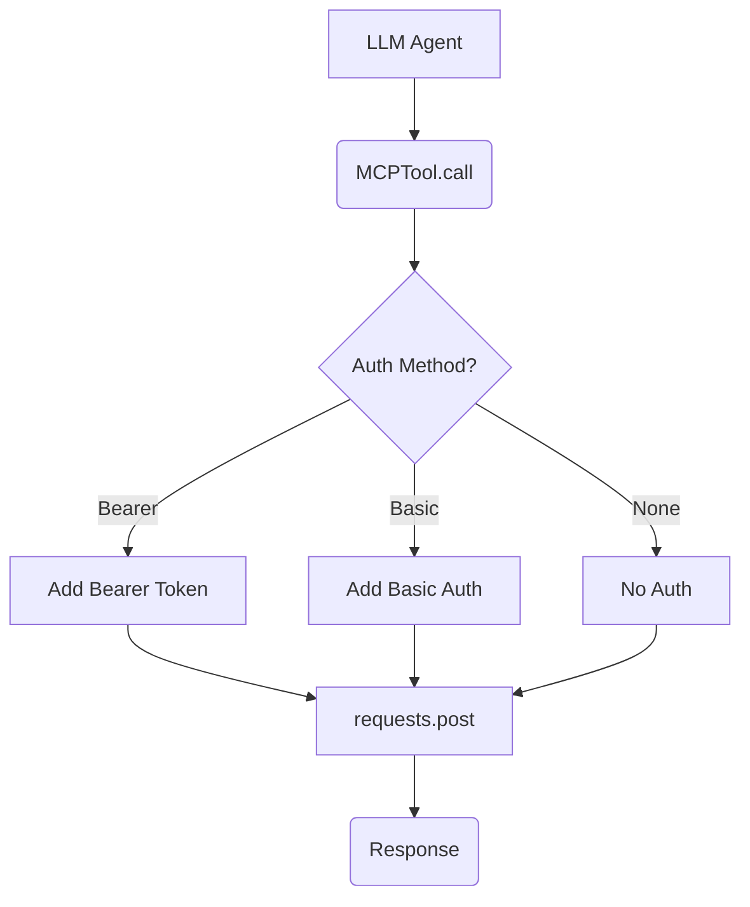

The diagram above shows the process of calling an `MCPTool`.  The `call` method handles different authentication methods before making the API request. Sources: [src/fyodorov_llm_agents/tools/mcp_tool_model.py]()

### Agent Model

The `Agent` model defines the structure of an agent, including its name, description, prompt, associated tools, and RAG (Retrieval-Augmented Generation) configuration.  The model includes validation methods to ensure the integrity of the agent's data. Sources: [src/fyodorov_llm_agents/agents/agent_model.py]()

```python
class Agent(BaseModel):
    id: Optional[int] = None
    created_at: Optional[datetime] = None
    api_key: str | None = None
    api_url: HttpUrl | None = None
    tools: list[str] = []
    rag: list[dict] = []
    model: LLMModel | None = None
    provider: ProviderModel | None = None
    name: str = "My Agent"
    description: str = "My Agent Description"
    prompt: str = "My Prompt"
    prompt_size: int = 10000
    public: bool | None = False
```
Sources: [src/fyodorov_llm_agents/agents/agent_model.py:9-24]()

## Instance Service and Chat Flow

The `InstanceService` handles chat sessions with agents. It retrieves the agent configuration, including tools, and manages the chat history. The `chat_w_fn_calls` method orchestrates the interaction between the user, the agent, and the LLM, incorporating function calling if necessary. Sources: [src/fyodorov_llm_agents/instances/instance_service.py]()

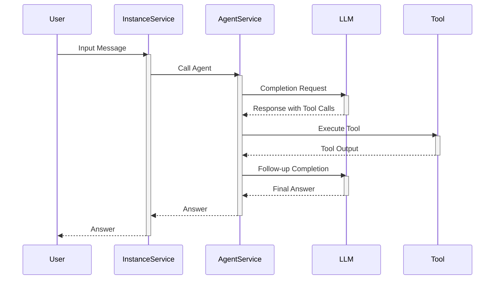

This sequence diagram illustrates the flow of a chat session with function calling. The `InstanceService` manages the overall flow, while the `AgentService` handles the interaction with the LLM and the execution of tools. Sources: [src/fyodorov_llm_agents/instances/instance_service.py](), [src/fyodorov_llm_agents/agents/agent_service.py]()

## Summary

This guide provides an overview of the core components and processes involved in getting started with the fyodorov-llm-agents project. It covers the key dependencies, agent and tool models, and the chat flow. Understanding these elements is essential for developing and deploying LLM agents within the system.


---

<a id='architecture-overview'></a>

## Architecture Overview

<details>
<summary>Relevant source files</summary>

The following files were used as context for generating this wiki page:

- [src/fyodorov_llm_agents/agents/agent_service.py](src/fyodorov_llm_agents/agents/agent_service.py)
- [src/fyodorov_llm_agents/tools/mcp_tool_model.py](src/fyodorov_llm_agents/tools/mcp_tool_model.py)
- [src/fyodorov_llm_agents/agents/agent_model.py](src/fyodorov_llm_agents/agents/agent_model.py)
- [src/fyodorov_llm_agents/tools/tool.py](src/fyodorov_llm_agents/tools/tool.py)
- [src/fyodorov_llm_agents/instances/instance_service.py](src/fyodorov_llm_agents/instances/instance_service.py)
- [src/fyodorov_llm_agents/instances/instance_model.py](src/fyodorov_llm_agents/instances/instance_model.py)
</details>

# Architecture Overview

This document provides an overview of the architecture for the agent system, focusing on how agents are created, configured, and used to interact with LLMs and tools. The architecture includes models for agents, tools, and instances, as well as services for managing these components. This system allows for the creation of intelligent agents capable of leveraging various tools to accomplish tasks.

## Agent Model and Service

The Agent is a central component, defined by `AgentModel` and managed by `AgentService`. The `AgentModel` holds the configuration for an agent, including its name, description, prompt, associated tools, and the LLM it uses. The `AgentService` provides methods for creating, updating, and retrieving agents from a database. Sources: [src/fyodorov_llm_agents/agents/agent_model.py](), [src/fyodorov_llm_agents/agents/agent_service.py]()

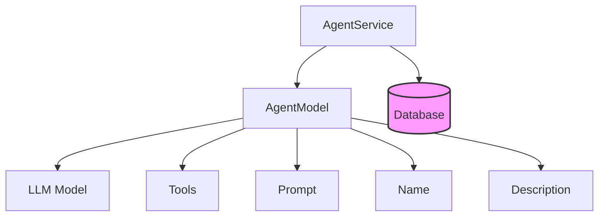

The `AgentModel` includes the following attributes:

| Attribute     | Type                 | Description                                                                                                | Source                                         |
| ------------- | -------------------- | ---------------------------------------------------------------------------------------------------------- | ---------------------------------------------- |
| id            | `Optional[int]`      | Unique identifier for the agent.                                                                          | [src/fyodorov_llm_agents/agents/agent_model.py]() |
| created_at    | `Optional[datetime]` | Timestamp indicating when the agent was created.                                                           | [src/fyodorov_llm_agents/agents/agent_model.py]() |
| api_key       | `str | None`         | API key for accessing the LLM.                                                                            | [src/fyodorov_llm_agents/agents/agent_model.py]() |
| api_url       | `HttpUrl | None`     | API endpoint for the LLM.                                                                                 | [src/fyodorov_llm_agents/agents/agent_model.py]() |
| tools         | `list[str]`          | List of tool names associated with the agent.                                                               | [src/fyodorov_llm_agents/agents/agent_model.py]() |
| rag           | `list[dict]`         | Retrieval-augmented generation configuration.                                                              | [src/fyodorov_llm_agents/agents/agent_model.py]() |
| model         | `LLMModel | None`     | The LLM model used by the agent.                                                                           | [src/fyodorov_llm_agents/agents/agent_model.py]() |
| provider      | `ProviderModel | None`| The provider of the LLM.                                                                                  | [src/fyodorov_llm_agents/agents/agent_model.py]() |
| name          | `str`                | Name of the agent.                                                                                          | [src/fyodorov_llm_agents/agents/agent_model.py]() |
| description   | `str`                | Description of the agent.                                                                                   | [src/fyodorov_llm_agents/agents/agent_model.py]() |
| prompt        | `str`                | Prompt used to guide the agent's behavior.                                                                  | [src/fyodorov_llm_agents/agents/agent_model.py]() |
| prompt_size   | `int`                | Maximum size of the prompt.                                                                                 | [src/fyodorov_llm_agents/agents/agent_model.py]() |
| public        | `bool | None`        | Indicates whether the agent is publicly accessible.                                                          | [src/fyodorov_llm_agents/agents/agent_model.py]() |

The `AgentService` provides methods to interact with the database:

*   `create_in_db(access_token: str, agent: AgentModel) -> str`: Creates a new agent in the database. Sources: [src/fyodorov_llm_agents/agents/agent_service.py]()
*   `update_in_db(id: str, agent: dict) -> dict`: Updates an existing agent in the database. Sources: [src/fyodorov_llm_agents/agents/agent_service.py]()

## Tool Model and Service

Tools are defined by the `MCPTool` model and managed by the `ToolService`. The `MCPTool` model represents an external tool that the agent can use, and it includes information such as the tool's name, description, API URL, and authentication details. The `ToolService` provides methods for retrieving tools and calling them. Sources: [src/fyodorov_llm_agents/tools/mcp_tool_model.py](), [src/fyodorov_llm_agents/tools/mcp_tool_service.py]()

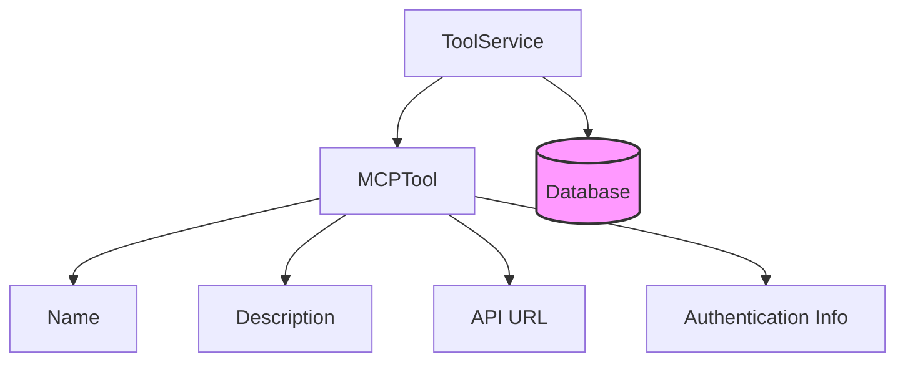

The `MCPTool` model contains the following fields:

| Field          | Type                   | Description                                                                                                  | Source                                          |
| -------------- | ---------------------- | ------------------------------------------------------------------------------------------------------------ | ----------------------------------------------- |
| id             | `Optional[int]`        | Unique identifier for the tool.                                                                              | [src/fyodorov_llm_agents/tools/mcp_tool_model.py]() |
| created_at     | `Optional[datetime]`   | Timestamp indicating when the tool was created.                                                               | [src/fyodorov_llm_agents/tools/mcp_tool_model.py]() |
| updated_at     | `Optional[datetime]`   | Timestamp indicating when the tool was last updated.                                                            | [src/fyodorov_llm_agents/tools/mcp_tool_model.py]() |
| name           | `Optional[str]`        | Name of the tool.                                                                                              | [src/fyodorov_llm_agents/tools/mcp_tool_model.py]() |
| handle         | `Optional[str]`        | A short, unique handle for the tool.                                                                         | [src/fyodorov_llm_agents/tools/mcp_tool_model.py]() |
| description    | `Optional[str]`        | Description of the tool's functionality.                                                                       | [src/fyodorov_llm_agents/tools/mcp_tool_model.py]() |
| logo_url       | `Optional[str]`        | URL of the tool's logo.                                                                                        | [src/fyodorov_llm_agents/tools/mcp_tool_model.py]() |
| user_id        | `Optional[str]`        | ID of the user who created the tool.                                                                           | [src/fyodorov_llm_agents/tools/mcp_tool_model.py]() |
| public         | `Optional[bool]`       | Indicates whether the tool is publicly accessible.                                                              | [src/fyodorov_llm_agents/tools/mcp_tool_model.py]() |
| api_type       | `Optional[str]`        | Type of API (e.g., "openapi").                                                                                 | [src/fyodorov_llm_agents/tools/mcp_tool_model.py]() |
| api_url        | `Optional[str]`        | URL of the tool's API.                                                                                         | [src/fyodorov_llm_agents/tools/mcp_tool_model.py]() |
| auth_method    | `Optional[str]`        | Authentication method used by the tool (e.g., "bearer", "basic").                                               | [src/fyodorov_llm_agents/tools/mcp_tool_model.py]() |
| auth_info      | `Optional[Dict[str, Any]]` | Authentication information (e.g., API key, username/password).                                                 | [src/fyodorov_llm_agents/tools/mcp_tool_model.py]() |
| capabilities   | `Optional[Dict[str, Any]]` | Dictionary describing the tool's capabilities, including available functions.                                   | [src/fyodorov_llm_agents/tools/mcp_tool_model.py]() |
| health_status  | `Optional[str]`        | Current health status of the tool.                                                                             | [src/fyodorov_llm_agents/tools/mcp_tool_model.py]() |
| usage_notes    | `Optional[str]`        | Notes on how to use the tool.                                                                                  | [src/fyodorov_llm_agents/tools/mcp_tool_model.py]() |

The `ToolService` offers the following functionalities:

*   `get_by_name_and_user_id(access_token: str, tool_name: str, user_id: str) -> ToolModel`: Retrieves a tool by its name and user ID. Sources: [src/fyodorov_llm_agents/tools/mcp_tool_service.py]()
*   `call(args: dict) -> str`: Calls the tool's API with the provided arguments. Sources: [src/fyodorov_llm_agents/tools/mcp_tool_model.py]()
*   `get_function() -> dict`: Converts the MCP tool into a function definition usable by LLMs (OpenAI-style). Sources: [src/fyodorov_llm_agents/tools/mcp_tool_model.py]()

## Instance Model and Service

The `Instance` represents a specific instantiation of an agent, including its chat history. The `InstanceService` manages the creation and retrieval of instances, as well as the execution of chat sessions. Sources: [src/fyodorov_llm_agents/instances/instance_model.py](), [src/fyodorov_llm_agents/instances/instance_service.py]()

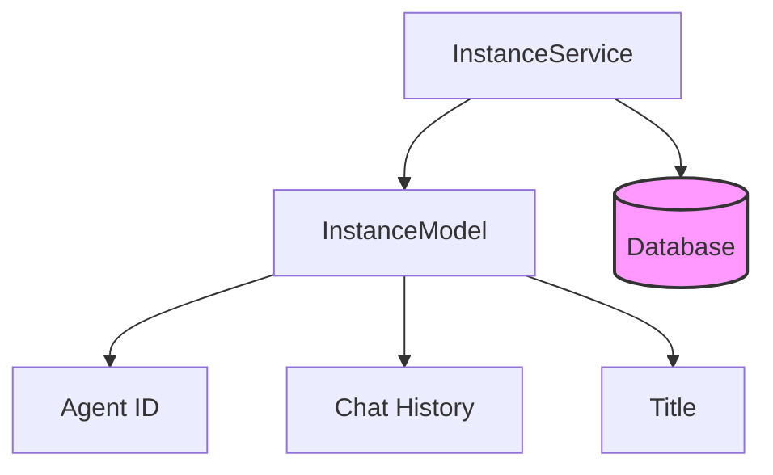

Key attributes of the `InstanceModel`:

| Attribute    | Type           | Description                                  | Source                                       |
| ------------ | -------------- | -------------------------------------------- | -------------------------------------------- |
| id           | `int`          | Unique identifier for the instance.          | [src/fyodorov_llm_agents/instances/instance_model.py]() |
| agent_id     | `int`          | ID of the associated agent.                  | [src/fyodorov_llm_agents/instances/instance_model.py]() |
| title        | `str`          | Title of the instance.                       | [src/fyodorov_llm_agents/instances/instance_model.py]() |
| chat_history | `list[dict]` | List of messages in the chat history.        | [src/fyodorov_llm_agents/instances/instance_model.py]() |

The `InstanceService` provides the following methods:

*   `chat_w_fn_calls(input: str, access_token: str, user_id: str) -> str`: Executes a chat session with function calling capabilities. Sources: [src/fyodorov_llm_agents/instances/instance_service.py]()
*   `create_in_db(instance: InstanceModel)`: Creates or updates an instance in the database. Sources: [src/fyodorov_llm_agents/instances/instance_service.py]()

The `chat_w_fn_calls` method orchestrates the interaction between the agent, LLM, and tools.  It retrieves the agent configuration, enriches the prompt with tool descriptions, and then uses the `AgentService` to call the LLM with the appropriate function calling capabilities. Sources: [src/fyodorov_llm_agents/instances/instance_service.py](), [src/fyodorov_llm_agents/agents/agent_service.py]()

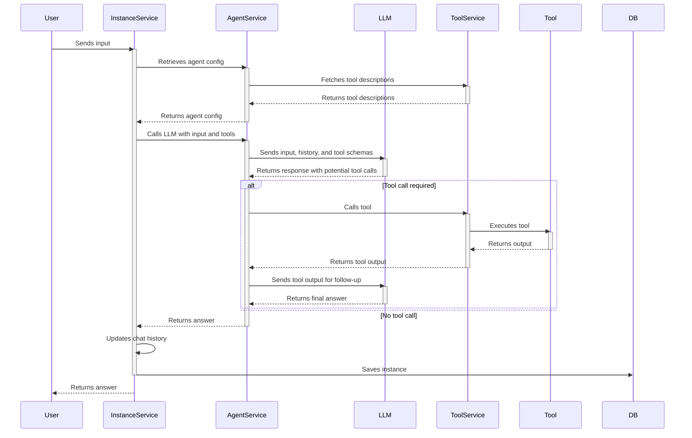

## Tool Calling Flow

The architecture supports tool calling, where the LLM can request the agent to use a specific tool to gather information or perform an action. The `AgentService` handles the tool calling flow, which involves:

1.  The LLM returns a response that includes a `tool_call` object, indicating that a tool should be used. Sources: [src/fyodorov_llm_agents/agents/agent_service.py]()
2.  The `AgentService` extracts the tool name and arguments from the `tool_call` object. Sources: [src/fyodorov_llm_agents/agents/agent_service.py]()
3.  The `AgentService` calls the `ToolService` to execute the specified tool with the provided arguments. Sources: [src/fyodorov_llm_agents/agents/agent_service.py]()
4.  The `ToolService` executes the tool and returns the result to the `AgentService`. Sources: [src/fyodorov_llm_agents/tools/mcp_tool_model.py]()
5.  The `AgentService` sends the tool's output back to the LLM for a follow-up response. Sources: [src/fyodorov_llm_agents/agents/agent_service.py]()
6.  The LLM incorporates the tool's output into its response and returns the final answer. Sources: [src/fyodorov_llm_agents/agents/agent_service.py]()

## Conclusion

The architecture provides a flexible and extensible framework for building intelligent agents that can interact with LLMs and external tools. The separation of concerns between the agent, tool, and instance models and services allows for easy customization and integration with different LLMs and tool providers. The tool calling flow enables the agents to leverage external knowledge and capabilities to accomplish complex tasks.


---

<a id='architecture-data-flow'></a>

## Data Flow

<details>
<summary>Relevant source files</summary>

The following files were used as context for generating this wiki page:

- [src/fyodorov_llm_agents/agents/agent_service.py](src/fyodorov_llm_agents/agents/agent_service.py)
- [src/fyodorov_llm_agents/instances/instance_service.py](src/fyodorov_llm_agents/instances/instance_service.py)
- [src/fyodorov_llm_agents/tools/mcp_tool_model.py](src/fyodorov_llm_agents/tools/mcp_tool_model.py)
- [src/fyodorov_llm_agents/agents/agent_model.py](src/fyodorov_llm_agents/agents/agent_model.py)
- [src/fyodorov_llm_agents/tools/tool.py](src/fyodorov_llm_agents/tools/tool.py)
- [src/fyodorov_llm_agents/models/llm_service.py](src/fyodorov_llm_agents/models/llm_service.py)
</details>

# Data Flow

The data flow within the `fyodorov-llm-agents` project describes how user input is processed, how agents interact with tools and language models, and how the resulting output is generated and stored. This involves the interaction of several key components, including agents, tools, language models, and instances, to facilitate conversational AI interactions. The flow begins with user input, which is then processed by an agent, potentially leveraging external tools, and finally returns a response to the user.

This page outlines the process by which agents, tools, and language models interact to produce responses based on user input, and provides details on how data is passed between these components.

## Agent Call with Function Calling

The `call_with_fn_calling` function in `Agent` service orchestrates the interaction between the agent, language model, and available tools to generate a response. It handles the initial prompt construction, tool retrieval, and iterative calls to the language model based on tool use. Sources: [src/fyodorov_llm_agents/agents/agent_service.py:13-52]().

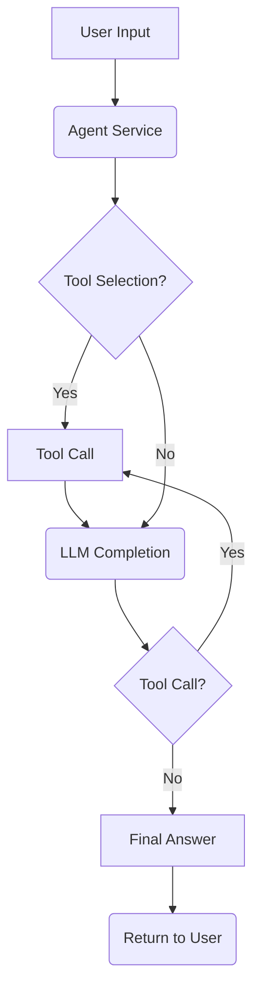

This diagram illustrates the flow of control in the `call_with_fn_calling` function. The process begins with user input being passed to the Agent Service. The agent determines if a tool is needed. If so, the agent calls the tool, and then uses the LLM to generate a completion. If the LLM completion requires another tool call, the process repeats. If not, the final answer is returned to the user.

### Tool Retrieval and Integration

The agent dynamically fetches and integrates tools based on its configuration. For each tool specified in the agent's configuration, the system attempts to retrieve the corresponding `ToolService` instance. The tool's description is then appended to the agent's prompt, providing the language model with context on available tools. Sources: [src/fyodorov_llm_agents/agents/agent_service.py:7-12](), [src/fyodorov_llm_agents/instances/instance_service.py:28-34]().

```python
# src/fyodorov_llm_agents/agents/agent_service.py
mcp_tools = []
for tool in self.tools:
    try:
        tool_instance = await ToolService.get_by_name_and_user_id(tool, user_id)
        mcp_tools.append(tool_instance)
    except Exception as e:
        print(f"Error fetching tool {tool}: {e}")
```
This code snippet shows how the agent retrieves tools by name and user ID. Sources: [src/fyodorov_llm_agents/agents/agent_service.py:9-14]().

### LLM Interaction with Tools

The `litellm.completion` function is used to interact with the language model. If tools are available, their schemas are included in the request. The response from the language model may include tool calls, which are then executed. The output of the tool is fed back into the language model to generate a final answer. Sources: [src/fyodorov_llm_agents/agents/agent_service.py:15-52]().

```python
# src/fyodorov_llm_agents/agents/agent_service.py
if tool_schemas:
    print(f"calling litellm with model {model}, messages: {messages}, max_retries: 0, history: {history}, base_url: {base_url}, tools: {tool_schemas}")
    response = litellm.completion(model=model, messages=messages, max_retries=0, base_url=base_url)
else:     
    print(f"calling litellm with model {model}, messages: {messages}, max_retries: 0, history: {history}, base_url: {base_url}")
    response = litellm.completion(model=model, messages=messages, max_retries=0, base_url=base_url)
```

This code snippet demonstrates how the `litellm.completion` function is called with or without tool schemas, depending on the availability of tools. Sources: [src/fyodorov_llm_agents/agents/agent_service.py:19-24]().

### MCPTool Call

The `MCPTool` class defines how a tool is called and how it interacts with external APIs. The `call` method constructs the API request based on the tool's configuration, handles authentication, and sends the request. Sources: [src/fyodorov_llm_agents/tools/mcp_tool_model.py:73-96]().

```python
# src/fyodorov_llm_agents/tools/mcp_tool_model.py
def call(self, args: dict) -> str:
    if not self.api_url:
        raise ValueError("MCP tool is missing an `api_url`")

    headers = {
        "Content-Type": "application/json",
        "User-Agent": "Fyodorov-Agent/1.0",
    }

    # Handle authentication
    if self.auth_method == "bearer":
        token = self.auth_info.get("token")
        if not token:
            raise ValueError("Bearer token required but not provided in `auth_info`")
        headers["Authorization"] = f"Bearer {token}"
    elif self.auth_method == "basic":
        user = self.auth_info.get("username")
        password = self.auth_info.get("password")
        if not user or not password:
            raise ValueError("Basic auth requires both username and password in `auth_info`")
        headers["Authorization"] = f"Basic {b64encode(f'{user}:{password}'.encode()).decode()}"

    try:
        response = requests.post(self.api_url, headers=headers, json=args)
        response.raise_for_status()  # Raise HTTPError for bad responses (4xx or 5xx)
        return response.text
    except requests.exceptions.RequestException as e:
        raise ValueError(f"Error calling tool API: {e}")
```

This code snippet illustrates how the `call` method in `MCPTool` handles API requests, including authentication. Sources: [src/fyodorov_llm_agents/tools/mcp_tool_model.py:73-96]().

## Instance Chat with Function Calls

The `chat_w_fn_calls` function within the `Instance` service manages the overall chat flow, including retrieving the agent, constructing the prompt, calling the agent with function calling, and updating the chat history. Sources: [src/fyodorov_llm_agents/instances/instance_service.py:23-41]().

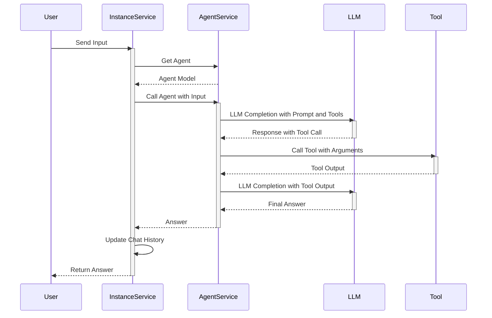

This sequence diagram illustrates the interaction between the user, instance service, agent service, LLM, and tool during the chat flow with function calls.

### Agent and Tool Retrieval

The `chat_w_fn_calls` function retrieves the agent based on the `agent_id` and then fetches the tools associated with the agent. It constructs the prompt by combining the agent's prompt with the descriptions of the available tools. Sources: [src/fyodorov_llm_agents/instances/instance_service.py:24-34]().

```python
# src/fyodorov_llm_agents/instances/instance_service.py
agent: AgentModel = await Agent.get_in_db(id = self.agent_id)
print(f"Model fetched via LLM.get_model in chat_w_fn_calls: {agent.model}")
agent.provider = await Provider.get_provider_by_id(id = agent.model.provider)
agent.prompt = f"{agent.prompt}\n\n{datetime.now().strftime('%Y-%m-%d %H:%M:%S')}\n\n"
print(f"Iterating over agent tools in chat_w_fn_calls: {agent.tools}")
for index, tool in enumerate(agent.tools):
    if isinstance(tool, str):
        agent.tools[index] = await ToolService.get_by_name_and_user_id(access_token, tool, user_id)
        print(f"Tool fetched via Tool.get_by_name_and_user_id in chat_w_fn_calls: {agent.tools[index]}")
        agent.prompt += f"\n\n{agent.tools[index].handle}: {agent.tools[index].description}\n\n"
```

This code snippet shows how the agent and its associated tools are retrieved and how the prompt is constructed. Sources: [src/fyodorov_llm_agents/instances/instance_service.py:24-34]().

### Chat History Management

The `chat_w_fn_calls` function updates the chat history by appending the user's input and the agent's response to the `chat_history` list. This history is then stored in the database. Sources: [src/fyodorov_llm_agents/instances/instance_service.py:36-40]().

```python
# src/fyodorov_llm_agents/instances/instance_service.py
self.chat_history.append({
    "role": "user",
    "content": input
})
self.chat_history.append({
    "role": "assistant",
    "content": res["answer"]
})
# Update history
await self.create_in_db(instance=self)
```

This code snippet demonstrates how the chat history is updated with the user's input and the agent's response. Sources: [src/fyodorov_llm_agents/instances/instance_service.py:36-40]().

## Tool Definition and Usage

The `Tool` and `MCPTool` classes define the structure and behavior of tools within the system. They include methods for validating tool configurations, converting tools to function definitions usable by language models, and calling the tools' APIs. Sources: [src/fyodorov_llm_agents/tools/tool.py](), [src/fyodorov_llm_agents/tools/mcp_tool_model.py]().

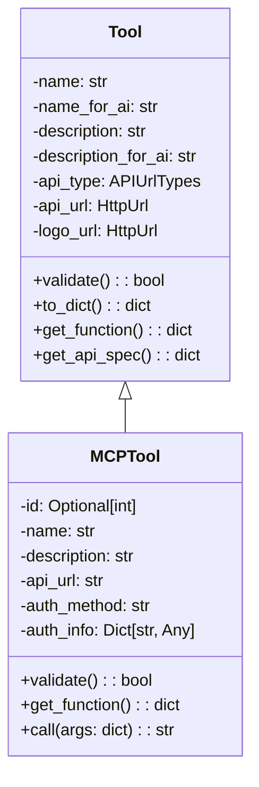

This class diagram shows the structure of the `Tool` and `MCPTool` classes.

### Tool Configuration and Validation

Both `Tool` and `MCPTool` classes include validation methods to ensure that the tool configurations are valid. These methods check for required fields, maximum lengths, and invalid characters. Sources: [src/fyodorov_llm_agents/tools/tool.py:25-42](), [src/fyodorov_llm_agents/tools/mcp_tool_model.py:35-40]().

```python
# src/fyodorov_llm_agents/tools/tool.py
def validate(self) -> bool:
    try:
        Tool.validate_name(self.name)
        Tool.validate_name_for_ai(self.name_for_ai)
        Tool.validate_description(self.description)
        Tool.validate_description_for_ai(self.description_for_ai)
    except ValueError as e:
        print("Tool model validation error:", e)
        return False
    else:
        return True
```

This code snippet demonstrates the validation process for the `Tool` class. Sources: [src/fyodorov_llm_agents/tools/tool.py:25-42]().

### Tool to Function Conversion

The `get_function` method in both `Tool` and `MCPTool` classes converts the tool configuration into a function definition that can be used by language models. This function definition includes the tool's name, description, and parameters. Sources: [src/fyodorov_llm_agents/tools/tool.py:82-90](), [src/fyodorov_llm_agents/tools/mcp_tool_model.py:61-69]().

```python
# src/fyodorov_llm_agents/tools/tool.py
def get_function(self) -> dict:
    # Load the OpenAPI spec
    openapi_spec = self.get_api_spec()
    functions = []
    # Iterate through the paths in the OpenAPI spec
    for path, methods in openapi_spec.get('paths', {}).items():
        for method, details in methods.items():
            # Generate a template for each method
            function = {
                'name': details.get('operationId') or f"{method.upper()} {path}",
                'url': f"{openapi_spec['servers'][0]['url']}{path}",  # Assuming first server is the correct one
                'method': method.upper(),
                'headers': {'Content-Type': 'application/json'},  # Assuming JSON, customize as needed
                'body': '{' + ', '.join([f'"{param["name"]}": ${{parameters.{param["name"]}}}' for param in details.get('parameters', []) if param['in'] == 'body']) + '}',
                # Include other necessary fields like parameters, authentication, etc.
            }
            functions.append(function)
    print(f"functions: {functions}")
    return functions
```

This code snippet shows how the `get_function` method in the `Tool` class generates a function definition from an OpenAPI specification. Sources: [src/fyodorov_llm_agents/tools/tool.py:82-90]().

## Agent Definition and Interaction

The `Agent` class defines the structure and behavior of an agent within the system. It includes methods for validating agent configurations and interacting with language models and tools. Sources: [src/fyodorov_llm_agents/agents/agent_model.py]().

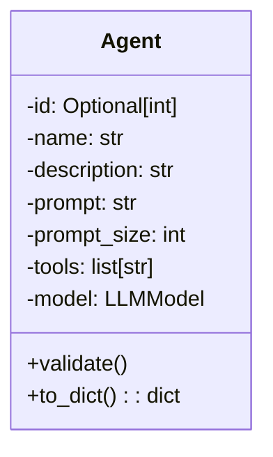

This class diagram shows the structure of the `Agent` class.

### Agent Configuration and Validation

The `Agent` class includes validation methods to ensure that the agent configurations are valid. These methods check for required fields, maximum lengths, and invalid characters. Sources: [src/fyodorov_llm_agents/agents/agent_model.py:20-30]().

```python
# src/fyodorov_llm_agents/agents/agent_model.py
def validate(self):
    Agent.validate_name(self.name)
    Agent.validate_description(self.description)
    Agent.validate_prompt(self.prompt, self.prompt_size)
```

This code snippet demonstrates the validation process for the `Agent` class. Sources: [src/fyodorov_llm_agents/agents/agent_model.py:20-30]().

### Agent Data Flow Summary

The data flow within the `fyodorov-llm-agents` project involves a complex interaction between users, agents, tools, and language models. The system is designed to handle user input, leverage external tools, and generate responses in a dynamic and flexible manner. The key components of the data flow include agent and tool retrieval, LLM interaction with tools, and chat history management.


---

<a id='features-agent-creation'></a>

## Agent Creation

<details>
<summary>Relevant source files</summary>

The following files were used as context for generating this wiki page:

- [src/fyodorov_llm_agents/agents/agent_model.py](src/fyodorov_llm_agents/agents/agent_model.py)
- [src/fyodorov_llm_agents/agents/agent_service.py](src/fyodorov_llm_agents/agents/agent_service.py)
- [src/fyodorov_llm_agents/models/llm_model.py](src/fyodorov_llm_agents/models/llm_model.py)
- [src/fyodorov_llm_agents/providers/provider_model.py](src/fyodorov_llm_agents/providers/provider_model.py)
- [src/fyodorov_llm_agents/tools/mcp_tool_service.py](src/fyodorov_llm_agents/tools/mcp_tool_service.py)
- [src/fyodorov_llm_agents/tools/mcp_tool_model.py](src/fyodorov_llm_agents/tools/mcp_tool_model.py)
</details>

# Agent Creation

Agent creation within the fyodorov-llm-agents project involves defining and storing configurations for language model agents. These agents utilize LLMs and tools to perform specific tasks. The creation process includes validating agent attributes, storing the agent configuration in a database, and associating tools with the agent.

## Agent Model

The `AgentModel` defines the structure and constraints for an agent. It includes attributes such as name, description, prompt, associated tools, and the underlying language model. `AgentModel` uses `pydantic` for data validation and serialization. Sources: [src/fyodorov_llm_agents/agents/agent_model.py:8]()

### Agent Attributes

The `Agent` class in `agent_model.py` inherits from `BaseModel` and defines the following attributes: Sources: [src/fyodorov_llm_agents/agents/agent_model.py:10-23]()

*   `id`: Optional unique identifier for the agent (integer).
*   `created_at`: Optional timestamp indicating when the agent was created (datetime).
*   `api_key`: Optional API key for accessing the language model (string).
*   `api_url`: Optional URL for the language model API (HttpUrl).
*   `tools`: A list of tool names associated with the agent (list of strings).
*   `rag`: A list of dictionaries for retrieval-augmented generation (list of dictionaries).
*   `model`: An `LLMModel` instance representing the language model used by the agent.
*   `provider`: A `ProviderModel` instance representing the provider of the language model.
*   `name`: The name of the agent (string, default: "My Agent").
*   `description`: A description of the agent (string, default: "My Agent Description").
*   `prompt`: The initial prompt for the agent (string, default: "My Prompt").
*   `prompt_size`: The maximum size of the prompt (integer, default: 10000).
*   `public`: A boolean indicating whether the agent is public or private (boolean, default: False).

### Validation

The `AgentModel` class includes a `validate` method to ensure that the agent's attributes meet certain criteria. Sources: [src/fyodorov_llm_agents/agents/agent_model.py:29-31]() The validation checks include:

*   `validate_name`: Checks if the name is present, does not exceed `MAX_NAME_LENGTH` (80), and contains only valid characters defined by `VALID_CHARACTERS_REGEX` (`^[a-zA-Z0-9\s.,!?:;'"-_]+$`). Sources: [src/fyodorov_llm_agents/agents/agent_model.py:42-48](), [src/fyodorov_llm_agents/agents/agent_model.py:8]()
*   `validate_description`: Checks if the description does not exceed `MAX_DESCRIPTION_LENGTH` (280) and contains only valid characters. Sources: [src/fyodorov_llm_agents/agents/agent_model.py:49-52](), [src/fyodorov_llm_agents/agents/agent_model.py:9]()
*   `validate_prompt`: Checks if the prompt does not exceed `prompt_size`. Sources: [src/fyodorov_llm_agents/agents/agent_model.py:53-55]()

### Data Model Diagram

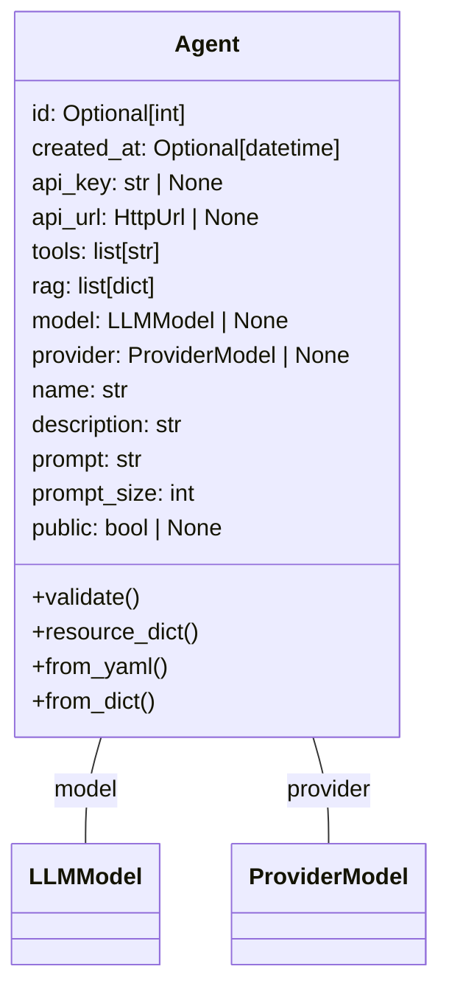

This diagram illustrates the main attributes of the `Agent` class and its relationships with `LLMModel` and `ProviderModel`. Sources: [src/fyodorov_llm_agents/agents/agent_model.py:10-23]()

## Agent Service

The `AgentService` class handles the creation, retrieval, updating, and deletion of agents in the database. It interacts with the Supabase client to perform these operations. Sources: [src/fyodorov_llm_agents/agents/agent_service.py:7]()

### Creating an Agent

The `create_in_db` method in `AgentService` is responsible for creating a new agent record in the database. Sources: [src/fyodorov_llm_agents/agents/agent_service.py:17-23]()

```python
@staticmethod    
async def create_in_db(access_token: str, agent: AgentModel) -> str:
    try:
        supabase = get_supabase(access_token)
        result = supabase.table('agents').upsert(agent.to_dict()).execute()
        agent_id = result.data[0]['id']
        return agent_id
    except Exception as e:
        print('Error creating agent', str(e))
        raise e
```

This method takes an `access_token` for authentication and an `AgentModel` instance as input. It uses the Supabase client to insert the agent's data into the `agents` table. The method returns the ID of the newly created agent. Sources: [src/fyodorov_llm_agents/agents/agent_service.py:17-23]()

### Updating an Agent

The `update_in_db` method updates an existing agent record in the database. Sources: [src/fyodorov_llm_agents/agents/agent_service.py:39-45]()

```python
@staticmethod
async def update_in_db(id: str, agent: dict) -> dict:
    if not id:
        raise ValueError('Agent ID is required')
    try:
        result = supabase.table('agents').update(agent).eq('id', id).execute()
        return result.data[0]
    except Exception as e:
        print('An error occurred while updating agent:', id, str(e))
        raise
```

This method takes the agent's ID and a dictionary containing the updated agent data as input. It uses the Supabase client to update the corresponding record in the `agents` table. The method returns the updated agent data. Sources: [src/fyodorov_llm_agents/agents/agent_service.py:39-45]()

### Assigning Tools to Agent

The `assign_agent_tools` method associates a list of tools with an agent. This is done by creating entries in the `agent_mcp_tools` table, which acts as a many-to-many relationship table between agents and tools. Sources: [src/fyodorov_llm_agents/agents/agent_service.py:149-161]()

```python
@staticmethod
async def assign_agent_tools(access_token: str, agent_id: str, tool_ids: list[ToolModel]) -> list:
    if not tool_ids:
        raise ValueError('Agent IDs are required')
    supabase = get_supabase(access_token)
    result = []
    for tool_id in tool_ids:
        agent_tool = {
            'agent_id': agent_id,
            'mcp_tool_id': tool_id.id
        }
        try:
            result = supabase.table('agent_mcp_tools').upsert(agent_tool).execute()
        except Exception as e:
            print('Error assigning agent tool', str(e))
            raise e

        result.append(tool_id)
    return result
```

The method iterates through the provided `tool_ids`, creating a new entry in the `agent_mcp_tools` table for each tool. Each entry links the `agent_id` with the `mcp_tool_id`. Sources: [src/fyodorov_llm_agents/agents/agent_service.py:149-161]()

### Agent Creation Flow

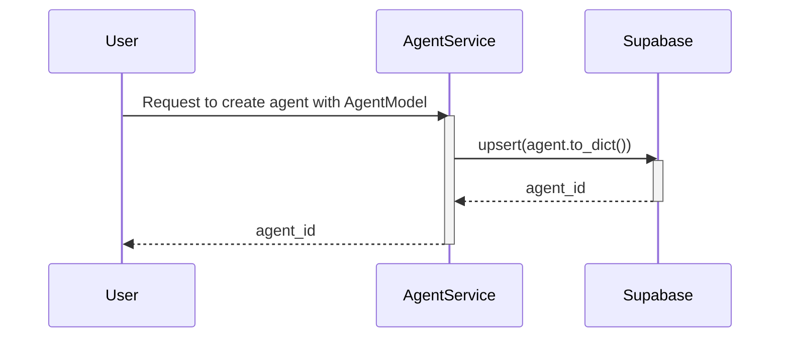

This sequence diagram illustrates the flow of creating an agent, starting from a user request to the `AgentService`, which then interacts with Supabase to store the agent data and returns the newly created agent's ID. Sources: [src/fyodorov_llm_agents/agents/agent_service.py:17-23]()

## Conclusion

The agent creation process involves defining the agent's attributes using the `AgentModel`, validating these attributes, and storing the agent configuration in a database using the `AgentService`. The process also includes associating tools with the agent, enabling it to perform specific tasks. This system allows for flexible and configurable agent creation, which is essential for the functionality of the fyodorov-llm-agents project.


---

<a id='features-tool-integration'></a>

## Tool Integration

<details>
<summary>Relevant source files</summary>

The following files were used as context for generating this wiki page:

- [src/fyodorov_llm_agents/tools/tool.py](src/fyodorov_llm_agents/tools/tool.py)
- [src/fyodorov_llm_agents/tools/mcp_tool_model.py](src/fyodorov_llm_agents/tools/mcp_tool_service.py)
- [src/fyodorov_llm_agents/agents/agent_service.py](src/fyodorov_llm_agents/agents/agent_service.py)
- [src/fyodorov_llm_agents/agents/agent_model.py](src/fyodorov_llm_agents/agents/agent_model.py)
- [src/fyodorov_llm_agents/instances/instance_service.py](src/fyodorov_llm_agents/instances/instance_service.py)
</details>

# Tool Integration

Tool integration in this project revolves around incorporating external tools and services into the agent framework to enhance its capabilities. This involves defining tool models, managing tool instances, and enabling agents to utilize these tools during their operation. The integration is facilitated through various services and models that handle tool creation, storage, retrieval, and execution. This page outlines the key components and processes involved in tool integration.

## Tool Definition and Management

The project uses two primary models for representing tools: `Tool` and `MCPTool`. The `Tool` model ([src/fyodorov_llm_agents/tools/tool.py]()) defines a generic tool with attributes such as name, description, API URL, and other metadata. The `MCPTool` model ([src/fyodorov_llm_agents/tools/mcp_tool_model.py]()) extends this concept with additional fields for database storage and management, including fields for authentication, capabilities, and health status.

### Tool Models

The `Tool` model is defined in `src/fyodorov_llm_agents/tools/tool.py` and includes the following fields:

*   `name`: The name of the tool. Sources: [src/fyodorov_llm_agents/tools/tool.py]()
*   `name_for_ai`: The name of the tool for AI interaction. Sources: [src/fyodorov_llm_agents/tools/tool.py]()
*   `description`: A description of the tool. Sources: [src/fyodorov_llm_agents/tools/tool.py]()
*   `description_for_ai`: A description of the tool for AI interaction. Sources: [src/fyodorov_llm_agents/tools/tool.py]()
*   `api_type`: The type of API (e.g., "openapi"). Sources: [src/fyodorov_llm_agents/tools/tool.py]()
*   `api_url`: The URL of the tool's API. Sources: [src/fyodorov_llm_agents/tools/tool.py]()
*   `logo_url`: The URL of the tool's logo. Sources: [src/fyodorov_llm_agents/tools/tool.py]()
*   `contact_email`: The contact email for the tool. Sources: [src/fyodorov_llm_agents/tools/tool.py]()
*   `legal_info_url`: The URL of the tool's legal information. Sources: [src/fyodorov_llm_agents/tools/tool.py]()
*   `public`: Indicates if the tool is public. Sources: [src/fyodorov_llm_agents/tools/tool.py]()
*   `user_id`: The ID of the user who owns the tool. Sources: [src/fyodorov_llm_agents/tools/tool.py]()

The `MCPTool` model, defined in `src/fyodorov_llm_agents/tools/mcp_tool_model.py`, includes the following additional fields:

*   `id`: The unique identifier of the tool in the database. Sources: [src/fyodorov_llm_agents/tools/mcp_tool_model.py]()
*   `created_at`: The timestamp when the tool was created. Sources: [src/fyodorov_llm_agents/tools/mcp_tool_model.py]()
*   `updated_at`: The timestamp when the tool was last updated. Sources: [src/fyodorov_llm_agents/tools/mcp_tool_model.py]()
*   `handle`: A unique handle for the tool. Sources: [src/fyodorov_llm_agents/tools/mcp_tool_model.py]()
*   `auth_method`: The authentication method used by the tool. Sources: [src/fyodorov_llm_agents/tools/mcp_tool_model.py]()
*   `auth_info`: The authentication information for the tool (e.g., API keys, tokens). Sources: [src/fyodorov_llm_agents/tools/mcp_tool_model.py]()
*   `capabilities`: A dictionary describing the tool's capabilities, including function definitions. Sources: [src/fyodorov_llm_agents/tools/mcp_tool_model.py]()
*   `health_status`: The health status of the tool. Sources: [src/fyodorov_llm_agents/tools/mcp_tool_model.py]()
*   `usage_notes`: Notes on how to use the tool. Sources: [src/fyodorov_llm_agents/tools/mcp_tool_model.py]()

### Tool Creation and Storage

The `MCPTool` service ([src/fyodorov_llm_agents/tools/mcp_tool_service.py]()) provides methods for creating, retrieving, updating, and deleting tools in the database. The `create_in_db` method inserts a new tool into the `mcp_tools` table. The `update_in_db` method updates an existing tool.

```python
@staticmethod    
async def create_in_db(access_token: str, tool: ToolModel, user_id: str) -> ToolModel:
    try:
        supabase = get_supabase(access_token)
        tool_dict = tool.to_dict()
        tool_dict['user_id'] = user_id
        if 'id' in tool_dict:
            del tool_dict['id']
        if 'created_at' in tool_dict:
            del tool_dict['created_at']
        if 'updated_at' in tool_dict:
            del tool_dict['updated_at']
        print('creating tool in db', tool_dict)
        result = supabase.table('mcp_tools').insert(tool_dict).execute()
        print('created tool in db', result)
        tool_dict = result.data[0]
        tool = ToolModel(**tool_dict)
        return tool
    except Exception as e:
        print('Error creating tool', str(e))
        raise e
```

Sources: [src/fyodorov_llm_agents/tools/mcp_tool_service.py:17-37]()

### Tool Retrieval

The `get_by_name_and_user_id` method retrieves a tool from the database based on its handle and user ID. The `get_tools` method retrieves a list of tools, optionally filtered by user ID and creation date.

```python
@staticmethod
async def get_by_name_and_user_id(access_token: str, name: str, user_id: str = None) -> ToolModel:
    try:
        supabase = get_supabase(access_token)
        print('getting tool from db', name, user_id)
        result = supabase.table('mcp_tools').select('*').eq('handle', name).eq('user_id', user_id).execute()
        if result.data:
            tool = ToolModel(**result.data[0])
            return tool
        else:
            return None
    except Exception as e:
        print('Error getting tool', str(e))
        raise e
```

Sources: [src/fyodorov_llm_agents/tools/mcp_tool_service.py:49-62]()

## Agent Integration with Tools

Agents utilize integrated tools to perform specific tasks. The `Agent` model ([src/fyodorov_llm_agents/agents/agent_model.py]()) includes a `tools` field, which is a list of tool names that the agent can use. The `AgentService` ([src/fyodorov_llm_agents/agents/agent_service.py]()) is responsible for managing agents and their interactions with tools.

### Agent Tool Usage

When an agent is called, the `call_with_fn_calling` method in `AgentService` is invoked. This method retrieves the tool instances associated with the agent and prepares them for use with the language model. The language model then determines which tool to use based on the input and the tool descriptions.

```python
async def call_with_fn_calling(self, input: str = "", history = [], user_id: str = "") -> dict:
    print('call_with_fn_calling')
    litellm.set_verbose = True
    # Set environmental variable
    print(f"[call_with_fn_calling] self.model: {self.model}")
    if self.provider:
        self.api_key = self.provider.api_key
        self.api_url = self.provider.api_url
        if self.provider.name == "gemini":
            model = 'gemini/'+self.model.name
            os.environ["GEMINI_API_KEY"] = self.api_key
    elif self.api_key.startswith('sk-'):
        model = 'openai/'+self.model.name
```

Sources: [src/fyodorov_llm_agents/agents/agent_service.py:84-95]()

### Tool Execution

The `call` method in `MCPTool` executes the tool by making an API call to the tool's `api_url`. The method handles authentication and sends the necessary parameters to the tool. The response from the tool is then returned to the agent.

```python
def call(self, args: dict) -> str:
    if not self.api_url:
        raise ValueError("MCP tool is missing an `api_url`")

    headers = {
        "Content-Type": "application/json",
        "User-Agent": "Fyodorov-Agent/1.0",
    }

    # Handle authentication
    if self.auth_method == "bearer":
        token = self.auth_info.get("token")
        if not token:
            raise ValueError("Bearer token required but not provided in `auth_info`")
        headers["Authorization"] = f"Bearer {token}"
    elif self.auth_method == "basic":
        user = self.auth_info.get("username")
        pwd = self.auth_info.get("password")
        if not user or not pwd:
            raise ValueError("Basic auth requires `username` and `password` in `auth_info`")
        auth = (user, pwd)
    else:
        auth = None  # anonymous access

    try:
        print(f"Calling MCP tool at {self.api_url} with args: {args}")
        response = requests.post(self.api_url, json=args, headers=headers, auth=auth)
        response.raise_for_status()
        content_type = response.headers.get("Content-Type", "")
        if "application/json" in content_type:
            return json.dumps(response.json(), indent=2)
        return response.text
    except requests.RequestException as e:
        print(f"Error calling MCP tool: {e}")
        return f"Error calling tool: {e}"
```

Sources: [src/fyodorov_llm_agents/tools/mcp_tool_model.py:133-175]()

### Sequence Diagram of Tool Integration

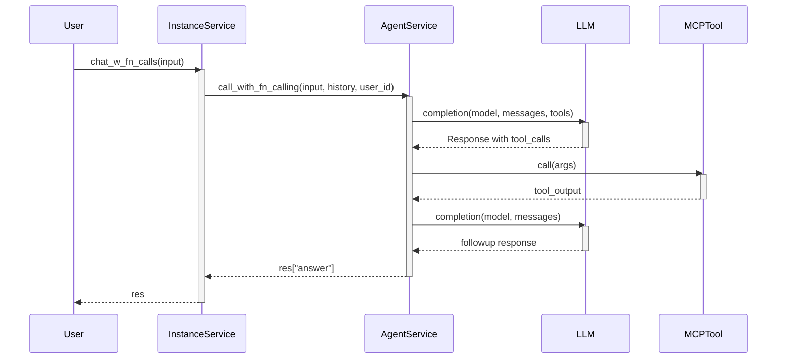

This diagram illustrates the flow of a request from the user to the `InstanceService`, which then calls the `AgentService`. The `AgentService` interacts with the LLM to determine which tool to use. The `MCPTool` is then called with the appropriate arguments, and the response is returned to the user. Sources: [src/fyodorov_llm_agents/instances/instance_service.py](), [src/fyodorov_llm_agents/agents/agent_service.py](), [src/fyodorov_llm_agents/tools/mcp_tool_model.py]()

## Tool Definition in YAML

Both `Tool` and `MCPTool` support instantiation from YAML definitions. This allows tools to be defined in a human-readable format and easily loaded into the system.

```python
@staticmethod
def from_yaml(yaml_str: str):
    """Instantiate Tool from YAML."""
    if not yaml_str:
        raise ValueError('YAML string is required')
    tool_dict = yaml.safe_load(yaml_str)
    if not isinstance(tool_dict, dict):
        raise ValueError('YAML string must represent a dictionary')
    tool = MCPTool(**tool_dict)
    if not tool.validate():
        print(f"Invalid tool data: {tool_dict}")
        return None
    return tool
```

Sources: [src/fyodorov_llm_agents/tools/mcp_tool_model.py:89-102]()

## Conclusion

Tool integration is a critical aspect of the agent framework, enabling agents to leverage external services and perform complex tasks. The `Tool` and `MCPTool` models provide a flexible and extensible way to define and manage tools. The `AgentService` facilitates the integration of these tools into the agent workflow, allowing agents to dynamically select and execute tools based on the input and the tool descriptions.


---

<a id='features-function-calling'></a>

## Function Calling

```html
<details>
<summary>Relevant source files</summary>

The following files were used as context for generating this wiki page:

- [src/fyodorov_llm_agents/agents/agent_service.py](src/fyodorov_llm_agents/agents/agent_service.py)
- [src/fyodorov_llm_agents/tools/mcp_tool_model.py](src/fyodorov_llm_agents/tools/mcp_tool_model.py)
- [src/fyodorov_llm_agents/instances/instance_service.py](src/fyodorov_llm_agents/instances/instance_service.py)
- [src/fyodorov_llm_agents/tools/tool.py](src/fyodorov_llm_agents/tools/tool.py)
- [src/fyodorov_llm_agents/agents/agent_model.py](src/fyodorov_llm_agents/agents/agent_model.py)
</details>
```

# Function Calling

Function calling in `fyodorov-llm-agents` allows agents to interact with external tools to perform specific tasks. This is achieved by converting tool definitions into a format that LLMs can understand and use to generate function calls. The agent then executes these calls and incorporates the results back into its reasoning process. This mechanism enables the agent to extend its capabilities beyond its internal knowledge and interact with the real world.

## Overview of Function Calling

Function calling involves several key steps: defining tools, converting them into function schemas, using these schemas in LLM calls, executing the tool calls, and incorporating the results back into the agent's response. The `MCPTool` model and the `Agent` service are central to this process. [Link to Agent Service](#agent-service) and [Link to MCPTool Model](#mcptool-model).

### MCPTool Model
The `MCPTool` model represents a tool that an agent can use. It includes information such as the tool's name, description, API URL, authentication method, and capabilities.  The `MCPTool` class, defined in `src/fyodorov_llm_agents/tools/mcp_tool_model.py`, is a Pydantic model that encapsulates the structure and validation logic for these tools. Sources: [src/fyodorov_llm_agents/tools/mcp_tool_model.py:16-32]()

Key attributes of the `MCPTool` model include:

*   `id`: Unique identifier for the tool.
*   `name`: The name of the tool.
*   `description`: A description of what the tool does.
*   `api_url`: The URL of the API endpoint for the tool.
*   `auth_method`: The authentication method required to use the tool (e.g., "bearer", "basic").
*   `auth_info`: Authentication credentials for the tool.
*   `capabilities`: A dictionary describing the tool's capabilities, including the functions it can perform.

The `MCPTool` model also includes validation methods to ensure that the tool's attributes are valid.  For example, the `_validate_name` and `_validate_description` methods check that the name and description contain only valid characters. Sources: [src/fyodorov_llm_agents/tools/mcp_tool_model.py:60-68]()

### Agent Service

The `Agent` service is responsible for managing agents, including creating, updating, and calling them. The `call_with_fn_calling` method in `src/fyodorov_llm_agents/agents/agent_service.py` is the core of the function calling mechanism. Sources: [src/fyodorov_llm_agents/agents/agent_service.py:71]()

The `call_with_fn_calling` method performs the following steps:

1.  **Prepare the LLM call**: It constructs the messages to be sent to the LLM, including the system prompt, chat history, and user input. Sources: [src/fyodorov_llm_agents/agents/agent_service.py:93-96]()
2.  **Fetch Tools**: It retrieves the tools associated with the agent and converts them into function schemas. Sources: [src/fyodorov_llm_agents/agents/agent_service.py:97-108]()
3.  **Call the LLM**: It calls the LLM with the messages and function schemas. Sources: [src/fyodorov_llm_agents/agents/agent_service.py:109-114]()
4.  **Handle Tool Calls**: If the LLM returns a tool call, it executes the tool and incorporates the result back into the messages. Sources: [src/fyodorov_llm_agents/agents/agent_service.py:118-139]()
5.  **Return the Answer**: It returns the LLM's answer. Sources: [src/fyodorov_llm_agents/agents/agent_service.py:141-146]()

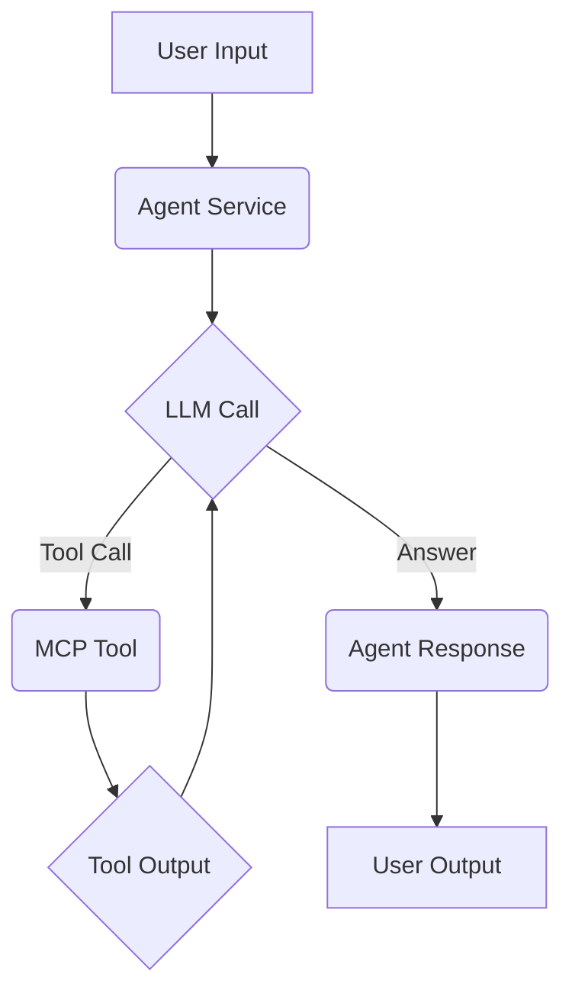

This diagram illustrates the high-level flow of function calling. The user input is passed to the agent service, which calls the LLM. If the LLM requests a tool call, the agent service executes the tool and incorporates the output back into the LLM call. Finally, the agent service returns the LLM's answer to the user. Sources: [src/fyodorov_llm_agents/agents/agent_service.py:71-146]()

## Detailed Function Calling Process

### Converting Tools to Function Schemas

Before an LLM can use a tool, the tool's definition must be converted into a function schema that the LLM understands.  The `get_function` method of the `MCPTool` model is responsible for this conversion. Sources: [src/fyodorov_llm_agents/tools/mcp_tool_model.py:49-54]()

The `get_function` method returns a dictionary containing the tool's name, description, and parameters.  This dictionary is then used as the `tools` argument in the `litellm.completion` call. Sources: [src/fyodorov_llm_agents/agents/agent_service.py:109-114]()

```python
def get_function(self) -> dict:
    """
    Convert this MCP tool into a function definition usable by LLMs (OpenAI-style).
    """
    if not self.capabilities or "functions" not in self.capabilities:
        raise ValueError(f"Tool '{self.name}' is missing `capabilities.functions`")

    # For now: return the first declared capability
    func = self.capabilities["functions"][0]
    return {
        "name": func["name"],
        "description": func.get("description", "No description provided."),
        "parameters": func.get("parameters", {}),
    }
```
Sources: [src/fyodorov_llm_agents/tools/mcp_tool_model.py:49-54]()

### Calling the LLM with Function Schemas

The `call_with_fn_calling` method in `Agent` service uses `litellm.completion` to call the LLM. The `tools` argument is set to the list of function schemas generated from the agent's tools. Sources: [src/fyodorov_llm_agents/agents/agent_service.py:109-114]()

```python
response = litellm.completion(
    model=model,
    messages=messages,
    max_retries=0,
    base_url=base_url,
    tools=tool_schemas
)
```
Sources: [src/fyodorov_llm_agents/agents/agent_service.py:110-114]()

If the LLM determines that it needs to use a tool, it will include a `tool_calls` attribute in its response. This attribute contains information about the tool to be called, including its name and arguments. Sources: [src/fyodorov_llm_agents/agents/agent_service.py:118-120]()

### Executing Tool Calls

If the LLM returns a tool call, the `call_with_fn_calling` method executes the tool by calling its `call` method. The `call` method in `MCPTool` makes an API call to the tool's endpoint. Sources: [src/fyodorov_llm_agents/tools/mcp_tool_model.py:81-105]()

```python
def call(self, args: dict) -> str:
    if not self.api_url:
        raise ValueError("MCP tool is missing an `api_url`")

    headers = {
        "Content-Type": "application/json",
        "User-Agent": "Fyodorov-Agent/1.0",
    }

    # Handle authentication
    if self.auth_method == "bearer":
        token = self.auth_info.get("token")
        if not token:
            raise ValueError("Bearer token required but not provided in `auth_info`")
        headers["Authorization"] = f"Bearer {token}"
    elif self.auth_method == "basic":
        user = self.auth_info.get("username")
        pwd = self.auth_info.get("password")
        if not user or not pwd:
            raise ValueError("Basic auth requires `username` and `password` in `auth_info`")
        auth = (user, pwd)
    else:
        auth = None  # anonymous access

    try:
        print(f"Calling MCP tool at {self.api_url} with args: {args}")
        response = requests.post(self.api_url, json=args, headers=headers, auth=auth)
        response.raise_for_status()
        content_type = response.headers.get("Content-Type", "")
        if "application/json" in content_type:
            return json.dumps(response.json(), indent=2)
        return response.text
    except requests.RequestException as e:
        print(f"Error calling MCP tool: {e}")
        return f"Error calling tool: {e}"
```
Sources: [src/fyodorov_llm_agents/tools/mcp_tool_model.py:81-105]()

The `call` method constructs an HTTP request to the tool's API endpoint, including any necessary headers and authentication information. It then sends the request and returns the response. The response is then incorporated back into the LLM's context.

### Incorporating Tool Outputs

After the tool is called, the output is added to the message history and sent back to the LLM for a follow-up completion. This allows the LLM to consider the tool's output when generating its final answer. Sources: [src/fyodorov_llm_agents/agents/agent_service.py:133-139]()

```python
messages.append({
    "role": "tool",
    "tool_call_id": tool_call.id,
    "content": tool_output,
})

followup = litellm.completion(
    model=model,
    messages=messages,
    max_retries=0,
    base_url=base_url,
)
return {"answer": followup.choices[0].message.content}
```
Sources: [src/fyodorov_llm_agents/agents/agent_service.py:133-139]()

## Tool Definition with OpenAPI

The `Tool` class in `src/fyodorov_llm_agents/tools/tool.py` supports defining tools using OpenAPI specifications. This allows for a standardized way to describe the tool's API, including its endpoints, parameters, and data types.

### Fetching the API Spec

The `get_api_spec` method fetches the OpenAPI specification from the tool's `api_url`. This method supports both JSON and YAML formats. Sources: [src/fyodorov_llm_agents/tools/tool.py:81-89]()

```python
def get_api_spec(self) -> dict:
    print(f"Fetching API spec from {self.api_url}")
    res = requests.get(self.api_url)
    print(f"API spec fetched from {self.api_url}: {res.status_code}")
    print(f"res: {res}")
    if res.status_code != 200:
        raise ValueError(f"Error fetching API spec from {self.api_url}: {res.status_code}")
    spec = {}
    url = str(self.api_url)
    if url.endswith('.json'):
        # Your code here
```
Sources: [src/fyodorov_llm_agents/tools/tool.py:81-89]()

### Generating Function Definitions from OpenAPI

The `get_function` method in `src/fyodorov_llm_agents/tools/tool.py` parses the OpenAPI specification and generates a list of function definitions that can be used by the LLM. For each path and method in the OpenAPI spec, it creates a function definition with the appropriate name, URL, method, headers, and body. Sources: [src/fyodorov_llm_agents/tools/tool.py:110-125]()

```python
def get_function(self) -> dict:
    # Load the OpenAPI spec
    openapi_spec = self.get_api_spec()
    functions = []
    # Iterate through the paths in the OpenAPI spec
    for path, methods in openapi_spec.get('paths', {}).items():
        for method, details in methods.items():
            # Generate a template for each method
            function = {
                'name': details.get('operationId') or f"{method.upper()} {path}",
                'url': f"{openapi_spec['servers'][0]['url']}{path}",  # Assuming first server is the correct one
                'method': method.upper(),
                'headers': {'Content-Type': 'application/json'},  # Assuming JSON, customize as needed
```
Sources: [src/fyodorov_llm_agents/tools/tool.py:110-125]()

## Instance Service and Chat History

The `Instance` class in `src/fyodorov_llm_agents/instances/instance_service.py` manages chat instances, including their chat history. The `chat_w_fn_calls` method uses the `Agent` service to call the LLM with function calling enabled and updates the chat history with the user input and the LLM's response. Sources: [src/fyodorov_llm_agents/instances/instance_service.py:18-38]()

```python
async def chat_w_fn_calls(self, input: str = "", access_token: str = JWT, user_id: str = "") -> str:
    agent: AgentModel = await Agent.get_in_db(id = self.agent_id)
    print(f"Model fetched via LLM.get_model in chat_w_fn_calls: {agent.model}")
    agent.provider = await Provider.get_provider_by_id(id = agent.model.provider)
    agent.prompt = f"{agent.prompt}\n\n{datetime.now().strftime('%Y-%m-%d %H:%M:%S')}\n\n"
    print(f"Iterating over agent tools in chat_w_fn_calls: {agent.tools}")
    for index, tool in enumerate(agent.tools):
        if isinstance(tool, str):
            agent.tools[index] = await ToolService.get_by_name_and_user_id(access_token, tool, user_id)
            print(f"Tool fetched via Tool.get_by_name_and_user_id in chat_w_fn_calls: {agent.tools[index]}")
            agent.prompt += f"\n\n{agent.tools[index].handle}: {agent.tools[index].description}\n\n"
    agent_service = Agent(agent)
    res = await agent_service.call_with_fn_calling(input=input, history=self.chat_history, user_id=user_id)
    self.chat_history.append({
        "role": "user",
        "content": input
    })
    self.chat_history.append({
        "role": "assistant",
        "content": res["answer"]
    })
    # Update history
    await self.create_in_db(instance=self)
    return res
```
Sources: [src/fyodorov_llm_agents/instances/instance_service.py:18-38]()

## Summary

Function calling in `fyodorov-llm-agents` provides a powerful mechanism for agents to interact with external tools and extend their capabilities. By converting tool definitions into function schemas, the system enables LLMs to generate tool calls that can be executed and incorporated back into the agent's reasoning process. The `MCPTool` model, the `Agent` service, and the `Tool` class are central to this process, providing the necessary components for defining, managing, and executing tool calls.


---

<a id='data-management-database-schema'></a>

## Database Schema

<details>
<summary>Relevant source files</summary>

The following files were used as context for generating this wiki page:

- [src/fyodorov_llm_agents/agents/agent_model.py](src/fyodorov_llm_agents/agents/agent_model.py)
- [src/fyodorov_llm_agents/tools/mcp_tool_model.py](src/fyodorov_llm_agents/tools/mcp_tool_model.py)
- [src/fyodorov_llm_agents/models/llm_model.py](src/fyodorov_llm_agents/models/llm_model.py)
- [src/fyodorov_llm_agents/providers/provider_model.py](src/fyodorov_llm_agents/providers/provider_model.py)
- [src/fyodorov_llm_agents/instances/instance_model.py](src/fyodorov_llm_agents/instances/instance_model.py)
- [src/fyodorov_llm_agents/tools/tool.py](src/fyodorov_llm_agents/tools/tool.py)
</details>

# Database Schema

The database schema defines the structure and organization of data within the fyodorov-llm-agents project. It encompasses the models that represent different entities, their attributes, and relationships. These models are primarily defined using Pydantic, providing a clear and validated structure for data storage and retrieval. The schema includes models for agents, tools, language learning models (LLMs), providers, and instances, reflecting the core components of the application.

## Agent Model

The `Agent` model represents an intelligent agent within the system, defining its attributes and configurations. It includes fields for basic information like `id`, `created_at`, `name`, and `description`, as well as configurations for the agent's behavior, such as the `prompt`, associated `tools`, and the underlying `model`. Sources: [src/fyodorov_llm_agents/agents/agent_model.py:7-32]()

```python
class Agent(BaseModel):
    id: Optional[int] = None
    created_at: Optional[datetime] = None
    api_key: str | None = None
    api_url: HttpUrl | None = None
    tools: list[str] = []
    rag: list[dict] = []
    model: LLMModel | None = None
    provider: ProviderModel | None = None
    name: str = "My Agent"
    description: str = "My Agent Description"
    prompt: str = "My Prompt"
    prompt_size: int = 10000
    public: bool | None = False
```
Sources: [src/fyodorov_llm_agents/agents/agent_model.py:7-21]()

### Agent Attributes

| Attribute   | Type                | Description                                                                     | Source                                                   |
| :---------- | :------------------ | :------------------------------------------------------------------------------ | :------------------------------------------------------- |
| `id`        | `Optional[int]`     | Unique identifier for the agent.                                              | [src/fyodorov_llm_agents/agents/agent_model.py:8]()      |
| `created_at`| `Optional[datetime]`| Timestamp indicating when the agent was created.                               | [src/fyodorov_llm_agents/agents/agent_model.py:9]()      |
| `api_key`   | `str | None`        | API key used for authentication.                                              | [src/fyodorov_llm_agents/agents/agent_model.py:10]()     |
| `api_url`   | `HttpUrl | None`    | URL for accessing the agent's API.                                             | [src/fyodorov_llm_agents/agents/agent_model.py:11]()     |
| `tools`     | `list[str]`         | List of tool names associated with the agent.                                   | [src/fyodorov_llm_agents/agents/agent_model.py:12]()     |
| `model`     | `LLMModel | None`  | The LLM model used by the agent.                                              | [src/fyodorov_llm_agents/agents/agent_model.py:14]()     |
| `provider`  | `ProviderModel | None`| The provider of the LLM model.                                                | [src/fyodorov_llm_agents/agents/agent_model.py:15]()     |
| `name`      | `str`               | Name of the agent.                                                              | [src/fyodorov_llm_agents/agents/agent_model.py:16]()     |
| `description`| `str`               | Description of the agent.                                                       | [src/fyodorov_llm_agents/agents/agent_model.py:17]()     |
| `prompt`    | `str`               | Prompt used to guide the agent's behavior.                                     | [src/fyodorov_llm_agents/agents/agent_model.py:18]()     |
| `prompt_size`| `int`               | Maximum size of the prompt.                                                     | [src/fyodorov_llm_agents/agents/agent_model.py:19]()     |
| `public`    | `bool | None`       | Indicates whether the agent is publicly accessible.                             | [src/fyodorov_llm_agents/agents/agent_model.py:20]()     |

The `Agent` model also includes validation methods to ensure data integrity, such as checking the length and characters of the `name`, `description`, and `prompt`. Sources: [src/fyodorov_llm_agents/agents/agent_model.py:34-52]()

### Agent Validation

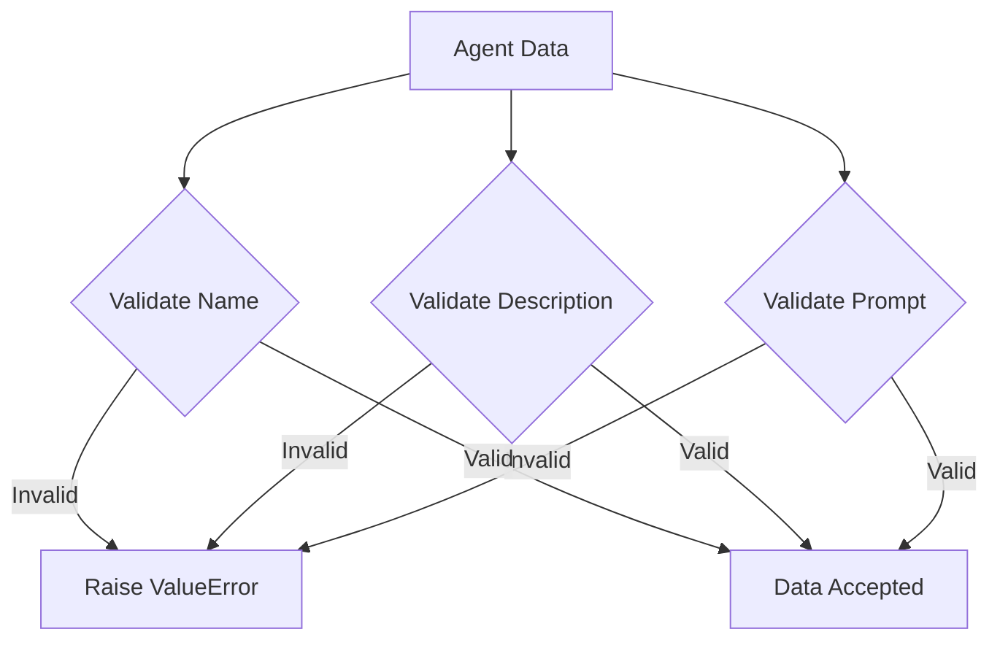

This diagram illustrates the validation process for the `Agent` model, ensuring that the `name`, `description`, and `prompt` fields meet the specified criteria. Sources: [src/fyodorov_llm_agents/agents/agent_model.py:34-52]()

## MCPTool Model

The `MCPTool` model represents a tool that can be used by the agent. It includes fields for the tool's `id`, `name`, `description`, `api_url`, and authentication information. The `capabilities` field stores a JSON object defining the tool's functions and parameters. Sources: [src/fyodorov_llm_agents/tools/mcp_tool_model.py:13-31]()

```python
class MCPTool(BaseModel):
    """
    Pydantic model corresponding to the 'mcp_tools' table.
    """
    # Database columns
    id: Optional[int] = None                          # bigserial (int8) primary key
    created_at: Optional[datetime] = None             # timestamptz
    updated_at: Optional[datetime] = None             # timestamptz

    name: Optional[str] = Field(..., max_length=MAX_NAME_LENGTH)
    handle: Optional[str] = None
    description: Optional[str] = Field(None, max_length=MAX_DESCRIPTION_LENGTH)
    logo_url: Optional[str] = None                    # stored as text; could be a URL
    user_id: Optional[str] = None                     # uuid

    public: Optional[bool] = False
    api_type: Optional[str] = None
    api_url: Optional[str] = None                     # stored as text; could also be HttpUrl
    auth_method: Optional[str] = None
    auth_info: Optional[Dict[str, Any]] = None        # jsonb
    capabilities: Optional[Dict[str, Any]] = None     # jsonb
    health_status: Optional[str] = None
    usage_notes: Optional[str] = None
```
Sources: [src/fyodorov_llm_agents/tools/mcp_tool_model.py:13-31]()

### MCPTool Attributes

| Attribute     | Type                  | Description                                                              | Source                                                    |
| :------------ | :-------------------- | :----------------------------------------------------------------------- | :-------------------------------------------------------- |
| `id`          | `Optional[int]`       | Unique identifier for the tool.                                          | [src/fyodorov_llm_agents/tools/mcp_tool_model.py:16]()    |
| `name`        | `Optional[str]`       | Name of the tool.                                                          | [src/fyodorov_llm_agents/tools/mcp_tool_model.py:20]()    |
| `handle`      | `Optional[str]`       | Handle or alias for the tool.                                            | [src/fyodorov_llm_agents/tools/mcp_tool_model.py:21]()    |
| `description` | `Optional[str]`       | Description of the tool.                                                   | [src/fyodorov_llm_agents/tools/mcp_tool_model.py:22]()    |
| `api_url`     | `Optional[str]`       | URL for accessing the tool's API.                                          | [src/fyodorov_llm_agents/tools/mcp_tool_model.py:26]()    |
| `auth_method` | `Optional[str]`       | Authentication method used by the tool.                                  | [src/fyodorov_llm_agents/tools/mcp_tool_model.py:27]()    |
| `auth_info`   | `Optional[Dict[str, Any]]`| Authentication information for the tool (e.g., API keys, tokens).       | [src/fyodorov_llm_agents/tools/mcp_tool_model.py:28]()    |
| `capabilities`| `Optional[Dict[str, Any]]`| JSON object defining the tool's functions and parameters.               | [src/fyodorov_llm_agents/tools/mcp_tool_model.py:29]()    |

Similar to the `Agent` model, the `MCPTool` model also includes validation methods to ensure data integrity, specifically for the `name` and `description` fields. Sources: [src/fyodorov_llm_agents/tools/mcp_tool_model.py:42-47]()

### MCPTool Validation

```mermaid
graph TD
    A[MCPTool Data] --> B{Validate Name};
    A --> C{Validate Description};
    B -- Invalid --> E[Raise ValueError];
    C -- Invalid --> E;
    B -- Valid --> F[Data Accepted];
    C -- Valid --> F;
```

This diagram illustrates the validation process for the `MCPTool` model, ensuring that the `name` and `description` fields meet the specified criteria. Sources: [src/fyodorov_llm_agents/tools/mcp_tool_model.py:42-47]()

## LLMModel

The `LLMModel` represents a language model, containing information about the model's name, provider, and other relevant details. Sources: [src/fyodorov_llm_agents/models/llm_model.py:4-10]()

```python
class LLMModel(BaseModel):
    id: Optional[int] = None
    created_at: Optional[datetime] = None
    name: str
    provider: str
    model_type: str | None = None
    settings: dict | None = None
```
Sources: [src/fyodorov_llm_agents/models/llm_model.py:4-10]()

### LLMModel Attributes

| Attribute   | Type                | Description                                                                     | Source                                               |
| :---------- | :------------------ | :------------------------------------------------------------------------------ | :--------------------------------------------------- |
| `id`        | `Optional[int]`     | Unique identifier for the LLM model.                                          | [src/fyodorov_llm_agents/models/llm_model.py:5]()   |
| `created_at`| `Optional[datetime]`| Timestamp indicating when the LLM model was created.                           | [src/fyodorov_llm_agents/models/llm_model.py:6]()   |
| `name`      | `str`               | Name of the LLM model.                                                          | [src/fyodorov_llm_agents/models/llm_model.py:7]()   |
| `provider`  | `str`               | Provider of the LLM model.                                                      | [src/fyodorov_llm_agents/models/llm_model.py:8]()   |
| `model_type` | `str | None`        | Type of the LLM model.                                                         | [src/fyodorov_llm_agents/models/llm_model.py:9]()   |
| `settings`  | `dict | None`       | Settings for the LLM model.                                                    | [src/fyodorov_llm_agents/models/llm_model.py:10]()  |

## ProviderModel

The `ProviderModel` represents a provider of LLMs, containing information about the provider's name, API key, and other relevant details. Sources: [src/fyodorov_llm_agents/providers/provider_model.py:4-10]()

```python
class ProviderModel(BaseModel):
    id: Optional[int] = None
    created_at: Optional[datetime] = None
    name: str
    api_key: str | None = None
    api_url: HttpUrl | None = None
    settings: dict | None = None
```
Sources: [src/fyodorov_llm_agents/providers/provider_model.py:4-10]()

### ProviderModel Attributes

| Attribute   | Type                | Description                                                                     | Source                                                       |
| :---------- | :------------------ | :------------------------------------------------------------------------------ | :----------------------------------------------------------- |
| `id`        | `Optional[int]`     | Unique identifier for the provider.                                           | [src/fyodorov_llm_agents/providers/provider_model.py:5]()   |
| `created_at`| `Optional[datetime]`| Timestamp indicating when the provider was created.                            | [src/fyodorov_llm_agents/providers/provider_model.py:6]()   |
| `name`      | `str`               | Name of the provider.                                                           | [src/fyodorov_llm_agents/providers/provider_model.py:7]()   |
| `api_key`   | `str | None`        | API key used for authentication with the provider.                              | [src/fyodorov_llm_agents/providers/provider_model.py:8]()   |
| `api_url`   | `HttpUrl | None`    | URL for accessing the provider's API.                                          | [src/fyodorov_llm_agents/providers/provider_model.py:9]()   |
| `settings`  | `dict | None`       | Settings for the provider.                                                     | [src/fyodorov_llm_agents/providers/provider_model.py:10]()  |

## InstanceModel

The `InstanceModel` represents an instance of an agent, storing the agent's ID, title, and chat history. Sources: [src/fyodorov_llm_agents/instances/instance_model.py:4-9]()

```python
class InstanceModel(BaseModel):
    id: int = Field(None, alias='id')
    agent_id: int # Links to AgentModel.id
    title: str = ""
    chat_history: list[dict] = []
```
Sources: [src/fyodorov_llm_agents/instances/instance_model.py:4-7]()

### InstanceModel Attributes

| Attribute     | Type             | Description                                                                 | Source                                                     |
| :------------ | :--------------- | :-------------------------------------------------------------------------- | :--------------------------------------------------------- |
| `id`          | `int`            | Unique identifier for the instance.                                         | [src/fyodorov_llm_agents/instances/instance_model.py:5]() |
| `agent_id`    | `int`            | ID of the associated agent.                                                 | [src/fyodorov_llm_agents/instances/instance_model.py:6]() |
| `title`       | `str`            | Title of the instance.                                                      | [src/fyodorov_llm_agents/instances/instance_model.py:7]() |
| `chat_history`| `list[dict]`     | List of chat messages associated with the instance.                          | [src/fyodorov_llm_agents/instances/instance_model.py:8]() |

The `InstanceModel` also includes a validation method to ensure data integrity, specifically for the `title` field. Sources: [src/fyodorov_llm_agents/instances/instance_model.py:11-14]()

## Tool Model

The `Tool` model represents a generic tool, containing information about the tool's name, description, API type, and URL. Sources: [src/fyodorov_llm_agents/tools/tool.py:13-23]()

```python
class Tool(BaseModel):
    name: str
    name_for_ai: str | None
    description: str
    description_for_ai: str | None
    api_type: APIUrlTypes
    api_url: HttpUrl
    logo_url: HttpUrl | None
    contact_email: str | None
    legal_info_url: str | None
    public: bool | None = False
    user_id: str | None = None
```
Sources: [src/fyodorov_llm_agents/tools/tool.py:13-23]()

### Tool Attributes

| Attribute          | Type              | Description                                                                      | Source                                           |
| :----------------- | :---------------- | :------------------------------------------------------------------------------- | :----------------------------------------------- |
| `name`             | `str`             | Name of the tool.                                                              | [src/fyodorov_llm_agents/tools/tool.py:14]()    |
| `name_for_ai`      | `str | None`      | Name of the tool for AI interaction.                                             | [src/fyodorov_llm_agents/tools/tool.py:15]()    |
| `description`      | `str`             | Description of the tool.                                                         | [src/fyodorov_llm_agents/tools/tool.py:16]()    |
| `description_for_ai`| `str | None`      | Description of the tool for AI interaction.                                        | [src/fyodorov_llm_agents/tools/tool.py:17]()    |
| `api_type`         | `APIUrlTypes`     | Type of the tool's API.                                                          | [src/fyodorov_llm_agents/tools/tool.py:18]()    |
| `api_url`          | `HttpUrl`         | URL for accessing the tool's API.                                                 | [src/fyodorov_llm_agents/tools/tool.py:19]()    |
| `logo_url`         | `HttpUrl | None`  | URL for the tool's logo.                                                         | [src/fyodorov_llm_agents/tools/tool.py:20]()    |
| `contact_email`    | `str | None`      | Contact email for the tool.                                                      | [src/fyodorov_llm_agents/tools/tool.py:21]()    |
| `legal_info_url`   | `str | None`      | URL for the tool's legal information.                                            | [src/fyodorov_llm_agents/tools/tool.py:22]()    |
| `public`           | `bool | None`     | Indicates whether the tool is publicly accessible.                               | [src/fyodorov_llm_agents/tools/tool.py:23]()    |
| `user_id`          | `str | None`     | User ID associated with the tool.                                                | [src/fyodorov_llm_agents/tools/tool.py:23]()    |

## Summary

The database schema for the fyodorov-llm-agents project is built around Pydantic models that define the structure and validation rules for key entities such as agents, tools, LLMs, providers, and instances. These models ensure data consistency and integrity, providing a solid foundation for the application's functionality. The schema supports the creation, retrieval, and management of these entities, enabling the development of intelligent agents and their interactions with various tools and language models.


---

<a id='backend-agent-service'></a>

## Agent Service

<details>
<summary>Relevant source files</summary>

The following files were used as context for generating this wiki page:

- [src/fyodorov_llm_agents/agents/agent_service.py](src/fyodorov_llm_agents/agents/agent_service.py)
- [src/fyodorov_llm_agents/agents/agent_model.py](src/fyodorov_llm_agents/agents/agent_model.py)
- [src/fyodorov_llm_agents/tools/mcp_tool_service.py](src/fyodorov_llm_agents/tools/mcp_tool_service.py)
- [src/fyodorov_llm_agents/models/llm_service.py](src/fyodorov_llm_agents/models/llm_service.py)
- [src/fyodorov_llm_agents/tools/mcp_tool_model.py](src/fyodorov_llm_agents/tools/mcp_tool_model.py)
- [src/fyodorov_llm_agents/instances/instance_service.py](src/fyodorov_llm_agents/instances/instance_service.py)
</details>

# Agent Service

The Agent Service provides the core functionality for creating, managing, and interacting with agents within the fyodorov-llm-agents project. It handles agent creation, storage, retrieval, and execution, including integration with various tools and language models. The Agent Service relies on the `Agent` model defined in `agent_model.py` and interacts with the database through Supabase. It also leverages `litellm` for calling language models. [src/fyodorov_llm_agents/agents/agent_service.py](). The service supports function calling, allowing agents to interact with external tools.

## Agent Creation

The Agent Service facilitates the creation of new agents, storing them in a Supabase database. The `create_in_db` and `create_agent_in_db` methods handle the insertion of agent data into the `agents` table. [src/fyodorov_llm_agents/agents/agent_service.py]().

```python
@staticmethod    
async def create_in_db(access_token: str, agent: AgentModel) -> str:
    try:
        supabase = get_supabase(access_token)
        result = supabase.table('agents').upsert(agent.to_dict()).execute()
        agent_id = result.data[0]['id']
        return agent_id
    except Exception as e:
        print('Error creating agent', str(e))
        raise e
```
Sources: [src/fyodorov_llm_agents/agents/agent_service.py:26-34]()

```python
@staticmethod    
async def create_agent_in_db(access_token: str, agent: dict, user_id: str) -> str:
    try:
        supabase = get_supabase(access_token)
        agent['user_id'] = user_id
        result = supabase.table('agents').upsert(agent).execute()
        agent_dict = result.data[0]
        return agent_dict
    except Exception as e:
        print('Error creating agent', str(e))
        raise e
```
Sources: [src/fyodorov_llm_agents/agents/agent_service.py:36-45]()

## Agent Model

The `Agent` class, defined in `agent_model.py`, represents an agent. It includes attributes such as `id`, `name`, `description`, `prompt`, `tools`, `model`, and `provider`. The `Agent` class uses `pydantic` for data validation and serialization. [src/fyodorov_llm_agents/agents/agent_model.py]().

```python
class Agent(BaseModel):
    id: Optional[int] = None
    created_at: Optional[datetime] = None
    api_key: str | None = None
    api_url: HttpUrl | None = None
    tools: list[str] = []
    rag: list[dict] = []
    model: LLMModel | None = None
    provider: ProviderModel | None = None
    name: str = "My Agent"
    description: str = "My Agent Description"
    prompt: str = "My Prompt"
    prompt_size: int = 10000
    public: bool | None = False
```
Sources: [src/fyodorov_llm_agents/agents/agent_model.py:11-26]()

The `Agent` model includes validation methods to ensure data integrity.

```python
    def validate(self):
        Agent.validate_name(self.name)
        Agent.validate_description(self.description)
        Agent.validate_prompt(self.prompt, self.prompt_size)
```
Sources: [src/fyodorov_llm_agents/agents/agent_model.py:34-37]()

## Agent Retrieval

The `get_in_db` method retrieves an agent from the Supabase database by its ID. [src/fyodorov_llm_agents/agents/agent_service.py]().

```python
    @staticmethod
    async def get_in_db(id: str) -> AgentModel:
        if not id:
            raise ValueError('Agent ID is required')
        try:
            supabase = get_supabase()
            result = supabase.table('agents').select("*").eq('id', id).execute()
            agent_dict = result.data[0]
            agent = AgentModel(**agent_dict)
            return agent
        except Exception as e:
            print('Error getting agent', str(e))
            raise e
```
Sources: [src/fyodorov_llm_agents/agents/agent_service.py:77-89]()

## Agent Update and Deletion

The Agent Service provides methods to update and delete agents in the database.

```python
    @staticmethod
    async def update_in_db(id: str, agent: dict) -> dict:
        if not id:
            raise ValueError('Agent ID is required')
        try:
            result = supabase.table('agents').update(agent).eq('id', id).execute()
            return result.data[0]
        except Exception as e:
            print('An error occurred while updating agent:', id, str(e))
            raise
```
Sources: [src/fyodorov_llm_agents/agents/agent_service.py:54-62]()

```python
    @staticmethod
    async def delete_in_db(id: str) -> bool:
        if not id:
            raise ValueError('Agent ID is required')
        try:
            result = supabase.table('agents').delete().eq('id', id).execute()
            return True
        except Exception as e:
            print('Error deleting agent', str(e))
            raise e
```
Sources: [src/fyodorov_llm_agents/agents/agent_service.py:64-75]()

## Agent Tool Management

Agents can be associated with tools. The Agent Service provides methods to manage these associations. [src/fyodorov_llm_agents/agents/agent_service.py]().

```python
    @staticmethod
    async def get_agent_tool_ids(access_token: str, agent_id: str) -> list:
        if not agent_id:
            raise ValueError('Agent ID is required')
        try:
            supabase = get_supabase(access_token)
            result = supabase.table('agent_mcp_tools').select("mcp_tool_id").eq('agent_id', agent_id).execute()
            tool_ids = result.data
            result = []
            for tool in tool_ids:
                result.append(tool['mcp_tool_id'])
            return result
        except Exception as e:
            print('Error getting agent tools', str(e))
            raise e
```
Sources: [src/fyodorov_llm_agents/agents/agent_service.py:91-105]()

## Agent Interaction and Function Calling

The `call_with_fn_calling` method is responsible for agent interaction, including calling language models and integrating with external tools through function calling. It uses `litellm` to interact with the language model and dynamically fetches tool information. [src/fyodorov_llm_agents/agents/agent_service.py]().

```python
    async def call_with_fn_calling(self, input: str = "", history = [], user_id: str = "") -> dict:
        print('call_with_fn_calling')
        litellm.set_verbose = True
        # Set environmental variable
        print(f"[call_with_fn_calling] self.model: {self.model}")
        if self.provider:
            self.api_key = self.provider.api_key
            self.api_url = self.provider.api_url
            if self.provider.name == "gemini":
                model = 'gemini/'+self.model.name
                os.environ["GEMINI_API_KEY"] = self.api_key
        elif self.api_key.startswith('sk-'):
            model = 'openai/'+self.model.name
```
Sources: [src/fyodorov_llm_agents/agents/agent_service.py:134-149]()

### Sequence Diagram: Agent Interaction with Function Calling

```mermaid
sequenceDiagram
    participant User
    participant InstanceService
    participant AgentService
    participant LLM
    participant ToolService
    participant MCPTool

    User->>InstanceService: Chat with input
    activate InstanceService
    InstanceService->>AgentService: call_with_fn_calling(input, history, user_id)
    activate AgentService
    AgentService->>LLM: litellm.completion(model, messages, tools)
    activate LLM
    LLM-->>AgentService: Response with tool_calls
    deactivate LLM
    AgentService->>ToolService: Get tool details
    activate ToolService
    ToolService->>MCPTool: Get tool function
    activate MCPTool
    MCPTool-->>ToolService: Tool function details
    deactivate MCPTool
    ToolService-->>AgentService: Tool details
    deactivate ToolService
    AgentService->>MCPTool: Call tool(args)
    activate MCPTool
    MCPTool-->>AgentService: tool_output
    deactivate MCPTool
    AgentService->>LLM: litellm.completion(model, messages + tool_output)
    activate LLM
    LLM-->>AgentService: Final Answer
    deactivate LLM
    AgentService-->>InstanceService: {"answer": answer}
    deactivate AgentService
    InstanceService-->>User: Response
    deactivate InstanceService
```

This diagram illustrates the flow of agent interaction with function calling, starting from the user input to the final answer generated by the language model. [src/fyodorov_llm_agents/agents/agent_service.py](), [src/fyodorov_llm_agents/tools/mcp_tool_model.py](), [src/fyodorov_llm_agents/models/llm_service.py](), [src/fyodorov_llm_agents/instances/instance_service.py]()

### Tool Schema and Function Calling

The `get_function` method in `MCPTool` model returns a function definition usable by LLMs. The `call` method executes the tool with provided arguments. [src/fyodorov_llm_agents/tools/mcp_tool_model.py]().

```python
    def get_function(self) -> dict:
        """
        Convert this MCP tool into a function definition usable by LLMs (OpenAI-style).
        """
        if not self.capabilities or "functions" not in self.capabilities:
            raise ValueError(f"Tool '{self.name}' is missing `capabilities.functions`")

        # For now: return the first declared capability
        func = self.capabilities["functions"][0]
        return {
            "name": func["name"],
            "description": func.get("description", "No description provided."),
            "parameters": func.get("parameters", {}),
        }

    def call(self, args: dict) -> str:
        if not self.api_url:
            raise ValueError("MCP tool is missing an `api_url`")

        headers = {
            "Content-Type": "application/json",
            "User-Agent": "Fyodorov-Agent/1.0",
        }

        # Handle authentication
        if self.auth_method == "bearer":
            token = self.auth_info.get("token")
            if not token:
                raise ValueError("Bearer token required but not provided in `auth_info`")
            headers["Authorization"] = f"Bearer {token}"
        elif self.auth_method == "basic":
            user = self.auth_info.get("username")
            password = self.auth_info.get("password")
            if not user or not password:
                raise ValueError("Username and password required but not provided in `auth_info`")
            headers["Authorization"] = f"Basic {b64encode(f'{user}:{password}'.encode()).decode()}"

        try:
            response = requests.post(self.api_url, headers=headers, json=args)
            response.raise_for_status()  # Raise HTTPError for bad responses (4xx or 5xx)
            return response.text  # Or response.json() if you expect JSON
        except requests.exceptions.RequestException as e:
            return f"Error calling tool: {e}"
```
Sources: [src/fyodorov_llm_agents/tools/mcp_tool_model.py:68-116]()

## Conclusion

The Agent Service is a crucial component for managing and interacting with agents, providing functionalities for creation, retrieval, update, deletion, and tool integration. It leverages Supabase for data persistence and `litellm` for language model interaction, enabling agents to perform complex tasks through function calling.


---

<a id='backend-tool-service'></a>

## Tool Service

<details>
<summary>Relevant source files</summary>

The following files were used as context for generating this wiki page:

- [src/fyodorov_llm_agents/tools/mcp_tool_service.py](src/fyodorov_llm_agents/tools/mcp_tool_service.py)
- [src/fyodorov_llm_agents/tools/mcp_tool_model.py](src/fyodorov_llm_agents/tools/mcp_tool_model.py)
- [src/fyodorov_llm_agents/agents/agent_service.py](src/fyodorov_llm_agents/agents/agent_service.py)
- [src/fyodorov_llm_agents/instances/instance_service.py](src/fyodorov_llm_agents/instances/instance_service.py)
- [src/fyodorov_llm_agents/tools/tool.py](src/fyodorov_llm_agents/tools/tool.py)
- [src/fyodorov_llm_agents/agents/agent_model.py](src/fyodorov_llm_agents/agents/agent_model.py)
</details>

# Tool Service

The Tool Service is responsible for managing and providing access to tools that can be used by agents. It handles the creation, retrieval, updating, and deletion of tools, as well as their association with agents. The service interacts with a database to persist tool information and provides methods for agents to call these tools during their execution. [src/fyodorov_llm_agents/tools/mcp_tool_service.py]().

The service uses the `MCPTool` model to represent tools and provides functionalities to convert these tools into function definitions usable by LLMs. It also handles the invocation of tool APIs, including authentication. [src/fyodorov_llm_agents/tools/mcp_tool_model.py]().

## MCPTool Model

The `MCPTool` model represents a tool with its associated metadata, API details, and capabilities. It includes fields for the tool's name, description, API URL, authentication method, and capabilities. [src/fyodorov_llm_agents/tools/mcp_tool_model.py]().

```mermaid
graph TD
    MCPToolModel --> APIUrl
    MCPToolModel --> AuthMethod
    MCPToolModel --> Capabilities

    APIUrl[API URL]
    AuthMethod[Auth Method]
    Capabilities[Capabilities]
```

The `MCPTool` model contains several fields:

| Field          | Type             | Description                                                                  | Source                                                                 |
|----------------|------------------|------------------------------------------------------------------------------|------------------------------------------------------------------------|
| id             | Optional[int]    | Unique identifier for the tool.                                              | [src/fyodorov_llm_agents/tools/mcp_tool_model.py:15]()               |
| created_at     | Optional[datetime] | Timestamp indicating when the tool was created.                               | [src/fyodorov_llm_agents/tools/mcp_tool_model.py:16]()               |
| updated_at     | Optional[datetime] | Timestamp indicating when the tool was last updated.                              | [src/fyodorov_llm_agents/tools/mcp_tool_model.py:17]()               |
| name           | Optional[str]    | Name of the tool.                                                            | [src/fyodorov_llm_agents/tools/mcp_tool_model.py:19]()               |
| description    | Optional[str]    | Description of the tool's functionality.                                       | [src/fyodorov_llm_agents/tools/mcp_tool_model.py:21]()               |
| api_url        | Optional[str]    | URL of the tool's API endpoint.                                                | [src/fyodorov_llm_agents/tools/mcp_tool_model.py:27]()               |
| auth_method    | Optional[str]    | Authentication method used by the tool (e.g., "bearer", "basic").             | [src/fyodorov_llm_agents/tools/mcp_tool_model.py:28]()               |
| auth_info      | Optional[Dict[str, Any]] | Authentication information required by the tool (e.g., token, username, password). | [src/fyodorov_llm_agents/tools/mcp_tool_model.py:29]()               |
| capabilities   | Optional[Dict[str, Any]] | Capabilities of the tool, including function definitions.                       | [src/fyodorov_llm_agents/tools/mcp_tool_model.py:30]()               |

The `get_function` method converts the `MCPTool` into a function definition suitable for use with LLMs. It extracts the function name, description, and parameters from the tool's capabilities. [src/fyodorov_llm_agents/tools/mcp_tool_model.py:71-77]().

The `call` method invokes the tool's API with the provided arguments. It handles authentication based on the tool's `auth_method` and sends a POST request to the `api_url`. The method returns the tool's response as a string. [src/fyodorov_llm_agents/tools/mcp_tool_model.py:80-106]().

## MCPTool Service Functionality

The `MCPTool` class in `mcp_tool_service.py` provides static methods for interacting with the database to manage tools. [src/fyodorov_llm_agents/tools/mcp_tool_service.py]().

### Creating and Updating Tools

The `create_or_update_in_db` method either creates a new tool or updates an existing one in the database. It first checks if a tool with the same handle already exists for the user. If it does, it updates the existing tool; otherwise, it creates a new one. [src/fyodorov_llm_agents/tools/mcp_tool_service.py:11-18]().

```mermaid
sequenceDiagram
    participant Client
    participant MCPToolService
    participant Database

    Client->>MCPToolService: create_or_update_in_db(tool, user_id)
    MCPToolService->>MCPToolService: get_by_name_and_user_id(tool.handle, user_id)
    MCPToolService->>Database: Check if tool exists
    Database-->>MCPToolService: Tool exists (True/False)
    alt Tool exists
        MCPToolService->>MCPToolService: update_in_db(tool.id, tool)
        MCPToolService->>Database: Update tool
        Database-->>MCPToolService: Updated tool
    else Tool does not exist
        MCPToolService->>MCPToolService: create_in_db(tool, user_id)
        MCPToolService->>Database: Insert tool
        Database-->>MCPToolService: Created tool
    end
    MCPToolService-->>Client: Tool
```

The `create_in_db` method inserts a new tool into the database. It takes the tool's data, adds the user ID, and executes an insert query. [src/fyodorov_llm_agents/tools/mcp_tool_service.py:20-32](). The `update_in_db` method updates an existing tool in the database. It takes the tool's ID and data and executes an update query. [src/fyodorov_llm_agents/tools/mcp_tool_service.py:34-45]().

### Retrieving Tools

The `get_by_name_and_user_id` method retrieves a tool from the database by its name and user ID. It executes a select query to find a tool matching the provided criteria. [src/fyodorov_llm_agents/tools/mcp_tool_service.py:47-58]().

The `get_by_id` method retrieves a tool from the database by its ID. It executes a select query to find a tool matching the provided ID. [src/fyodorov_llm_agents/tools/mcp_tool_service.py:60-70]().

The `get_tools` method retrieves a list of tools from the database, with options for filtering by user ID, limiting the number of results, and paginating using a `created_at` timestamp. It returns only public tools or tools belonging to the specified user. [src/fyodorov_llm_agents/tools/mcp_tool_service.py:72-91]().

### Connecting Tools to Agents

The `add_agent_tool_connection` method adds a connection between an agent and a tool in the `agent_mcp_tools` table. This indicates that the agent is authorized to use the tool. [src/fyodorov_llm_agents/tools/mcp_tool_service.py:93-107](). The `delete_agent_tool_connection` method removes a connection between an agent and a tool. [src/fyodorov_llm_agents/tools/mcp_tool_service.py:109-122]().

## Integration with Agents

The Tool Service is integrated with the agent service to allow agents to use tools during their execution. The `call_with_fn_calling` method in `Agent` retrieves the tools associated with the agent and converts them into function definitions. These function definitions are then passed to the LLM, which can use them to generate tool calls. [src/fyodorov_llm_agents/agents/agent_service.py:69-102]().

```mermaid
sequenceDiagram
    participant AgentService
    participant ToolService
    participant LLM

    AgentService->>ToolService: Get tools for agent
    loop For each tool
        ToolService->>ToolService: get_by_name_and_user_id(tool, user_id)
        ToolService-->>AgentService: Tool
    end
    AgentService->>AgentService: Convert tools to function definitions
    AgentService->>LLM: Call LLM with function definitions
    LLM-->>AgentService: Response with tool calls
```

The `Instance` service uses the `Agent` service, which in turn utilizes the `ToolService` to fetch the tools associated with an agent. This allows the agent to use the tools during its interaction with the user. [src/fyodorov_llm_agents/instances/instance_service.py:25-35]().

## Tool Definition

The `Tool` class in `tool.py` defines the structure of a tool, including its name, description, API type, and API URL. It also includes methods for validating the tool's data and converting it to different formats. [src/fyodorov_llm_agents/tools/tool.py]().

```mermaid
classDiagram
    class Tool {
        -name: str
        -name_for_ai: str | None
        -description: str
        -description_for_ai: str | None
        -api_type: APIUrlTypes
        -api_url: HttpUrl
        -logo_url: HttpUrl | None
        -contact_email: str | None
        -legal_info_url: str | None
        -public: bool | None = False
        -user_id: str | None = None
        +validate() : bool
        +to_dict() : dict
        +to_plugin() : dict
        +from_plugin_json(json: dict) : Tool
        +from_yaml(yaml_str: str) : Tool
        +get_function() : dict
        +get_api_spec() : dict
        +get_prompt() : str
    }
```

The `get_function` method in the `Tool` class retrieves the OpenAPI specification from the tool's API URL and extracts the function definitions from it. This allows the agent to dynamically discover the tool's capabilities. [src/fyodorov_llm_agents/tools/tool.py:169-188](). The `get_api_spec` method fetches the API specification from the tool's `api_url`. [src/fyodorov_llm_agents/tools/tool.py:190-200]().

## Summary

The Tool Service provides a comprehensive solution for managing and utilizing tools within the agent ecosystem. It handles the creation, retrieval, and invocation of tools, as well as their integration with agents. The service leverages the `MCPTool` model to represent tools and provides functionalities to convert these tools into function definitions usable by LLMs. The integration with the agent service allows agents to dynamically discover and use tools during their execution, enhancing their capabilities and enabling them to perform complex tasks.


---

<a id='model-integration-llms'></a>

## LLM Models

<details>
<summary>Relevant source files</summary>

The following files were used as context for generating this wiki page:

- [src/fyodorov_llm_agents/models/llm_model.py](src/fyodorov_llm_agents/models/llm_model.py)
- [src/fyodorov_llm_agents/models/llm_service.py](src/fyodorov_llm_agents/models/llm_service.py)
- [src/fyodorov_llm_agents/providers/provider_model.py](src/fyodorov_llm_agents/providers/provider_model.py)
- [src/fyodorov_llm_agents/providers/provider_service.py](src/fyodorov_llm_agents/providers/provider_service.py)
- [src/fyodorov_llm_agents/agents/agent_service.py](src/fyodorov_llm_agents/agents/agent_service.py)
- [src/fyodorov_llm_agents/instances/instance_service.py](src/fyodorov_llm_agents/instances/instance_service.py)
</details>

# LLM Models

LLM Models within this project define the structure and services for interacting with various Large Language Models. They provide an abstraction layer for different LLM providers, allowing the system to switch between models and providers easily. This system includes models for defining LLMs, services for managing them in the database, and integration with provider services.

## LLM Model Definition

The `LLMModel` class (defined in `src/fyodorov_llm_agents/models/llm_model.py`) is a Pydantic BaseModel that represents the structure of an LLM. It includes attributes such as name, provider, parameters, mode, base model, and cost per token.

```python
from pydantic import BaseModel, validator
from fyodorov_llm_agents.providers.provider_model import Provider as ProviderTypes

class LLMModel(BaseModel):
    id: int | None = None
    name: str
    provider: str | None = None
    provider_id: int | None = None
    params: dict | None = None
    mode: str = 'chat'
    base_model: str
    input_cost_per_token: float | None = None
    output_cost_per_token: float | None = None
    max_tokens: int | None = None
```
Sources: [src/fyodorov_llm_agents/models/llm_model.py:3-16]()

Key attributes of the `LLMModel` include:

*   `id`: Unique identifier for the LLM model (optional).
*   `name`: Name of the LLM model.
*   `provider`: Name of the LLM provider.
*   `provider_id`: ID of the LLM provider.
*   `params`: Dictionary of parameters for the LLM.
*   `mode`: Mode of operation (e.g., 'chat').
*   `base_model`: Base model name.
*   `input_cost_per_token`: Cost per input token.
*   `output_cost_per_token`: Cost per output token.
*   `max_tokens`: Maximum number of tokens.

The `to_dict` method converts the `LLMModel` to a dictionary.  The `resource_dict` method returns a dictionary containing the `id`, `name`, and `provider` of the LLM.  The `from_dict` method creates an `LLMModel` from a dictionary. Sources: [src/fyodorov_llm_agents/models/llm_model.py:18-47](), [src/fyodorov_llm_agents/models/llm_model.py:58-83]()

## LLM Service

The `LLM` class (defined in `src/fyodorov_llm_agents/models/llm_service.py`) provides services for managing LLM models in the database. It includes methods for saving, updating, and fetching LLM models.

### Saving Models

The `save_model_in_db` method saves an LLM model to the database. It retrieves or creates a provider using `Provider.get_or_create_provider` and then upserts the model data into the 'models' table. Sources: [src/fyodorov_llm_agents/models/llm_service.py:17-26](), [src/fyodorov_llm_agents/providers/provider_service.py:7]()

### Updating Models

The `update_model_in_db` method updates an existing LLM model in the database. It updates the model based on `user_id` and `name`. Sources: [src/fyodorov_llm_agents/models/llm_service.py:7-15]()

### Fetching Models

The `get_models_by_user_id` method fetches LLM models from the database based on the user ID. It allows filtering by created\_at and limiting the number of results.  It converts the database data into `LLMModel` instances. Sources: [src/fyodorov_llm_agents/models/llm_service.py:28-51]()

## Provider Integration

The LLM system integrates with provider services to manage different LLM providers.  The `Provider` class (defined in `src/fyodorov_llm_agents/providers/provider_service.py`) handles the retrieval and creation of provider entries in the database. The `ProviderModel` (defined in `src/fyodorov_llm_agents/providers/provider_model.py`) defines the structure for provider information, including name, API key, and other relevant details.

```mermaid
graph TD
    A[LLM Service] --> B(Provider Service);
    B --> C(Provider Model);
    A --> D(LLM Model);
    style A fill:#f9f,stroke:#333,stroke-width:2px
    style B fill:#ccf,stroke:#333,stroke-width:2px
    style C fill:#ccf,stroke:#333,stroke-width:2px
    style D fill:#f9f,stroke:#333,stroke-width:2px
```

The diagram above illustrates the relationship between the LLM Service, Provider Service, and their respective models. The LLM Service utilizes the Provider Service to manage LLM providers, and both services rely on their respective models for data structure. Sources: [src/fyodorov_llm_agents/models/llm_service.py](), [src/fyodorov_llm_agents/providers/provider_service.py](), [src/fyodorov_llm_agents/providers/provider_model.py]()

## Integration with Agents

LLM Models are integrated into the agent system via the `Agent` class in `src/fyodorov_llm_agents/agents/agent_service.py`.  The agent uses the LLM model to generate responses. The `call_with_fn_calling` method in `Agent` uses the LLM model to interact with external tools.  The `Instance` class in `src/fyodorov_llm_agents/instances/instance_service.py` uses the `Agent` class and its associated LLM model to handle chat interactions.

```python
class Agent(AgentModel):

    def __init__(self, agent: AgentModel):
        super().__init__(
            **agent.to_dict()
        )

    @staticmethod    
    async def create_in_db(access_token: str, agent: AgentModel) -> str:
        try:
            supabase = get_supabase(access_token)
            result = supabase.table('agents').upsert(agent.to_dict()).execute()
            agent_id = result.data[0]['id']
            return agent_id
        except Exception as e:
            print('Error creating agent', str(e))
            raise e
```
Sources: [src/fyodorov_llm_agents/agents/agent_service.py:45-60]()

## Summary

The LLM Models component provides a structured way to manage and interact with various Large Language Models within the project. It includes models for defining LLMs, services for database management, and integration with provider services and agents. This system allows for flexibility in choosing and configuring LLMs for different tasks.


---

<a id='model-integration-litellm'></a>

## LiteLLM Integration

<details>
<summary>Relevant source files</summary>

The following files were used as context for generating this wiki page:

- [src/fyodorov_llm_agents/agents/agent_service.py](src/fyodorov_llm_agents/agents/agent_service.py)
- [src/fyodorov_llm_agents/instances/instance_service.py](src/fyodorov_llm_agents/instances/instance_service.py)
- [src/fyodorov_llm_agents/agents/agent_model.py](src/fyodorov_llm_agents/agents/agent_model.py)
- [src/fyodorov_llm_agents/tools/mcp_tool_model.py](src/fyodorov_llm_agents/tools/mcp_tool_model.py)
- [src/fyodorov_llm_agents/models/llm_service.py](src/fyodorov_llm_agents/models/llm_service.py)
- [src/fyodorov_llm_agents/models/llm_model.py](src/fyodorov_llm_agents/models/llm_model.py)
</details>

# LiteLLM Integration

LiteLLM is integrated into the fyodorov-llm-agents project to provide a unified interface for interacting with various Language Model (LLM) providers. It simplifies the process of calling different LLMs by abstracting away the provider-specific details. This integration is primarily used within the agent service to handle communication with LLMs, including tool calling and response processing. [Link to Agent Service](#agent-service).

## Agent Service Integration

The `AgentService` utilizes LiteLLM to interact with language models. It constructs messages, manages tools, and processes responses from the LLMs.

### Message Construction

The `AgentService` constructs a list of messages to send to the LLM. This list includes the system prompt, chat history, and the user's input.

```python
messages: list[dict] = [
    {"content": self.prompt, "role": "system"},
    *history,
    { "content": input, "role": "user"},
]
```
Sources: [src/fyodorov_llm_agents/agents/agent_service.py:4-7]()

The `messages` list is structured as follows:

1.  **System Prompt:** The agent's initial prompt, defining its behavior.
2.  **Chat History:** A list of previous interactions between the user and the agent.
3.  **User Input:** The current user message.

### Tool Handling

The `AgentService` supports the use of tools to augment the capabilities of the LLM. It fetches tool instances and constructs a list of tool schemas to pass to LiteLLM.

```python
mcp_tools = []
for tool in self.tools:
    try:
        tool_instance = await ToolService.get_by_name_and_user_id(tool, user_id)
        mcp_tools.append(tool_instance)
    except Exception as e:
        print(f"Error fetching tool {tool}: {e}")

tool_schemas = [tool.get_function() for tool in mcp_tools]
```
Sources: [src/fyodorov_llm_agents/agents/agent_service.py:10-18]()

The `tool_schemas` are derived from the `get_function()` method of each tool, which returns a dictionary describing the tool's functionality.

### LiteLLM Completion

The `AgentService` uses the `litellm.completion` method to interact with the LLM. It passes the model, messages, and tool schemas (if any) to this method.

```python
if tool_schemas:
    print(f"calling litellm with model {model}, messages: {messages}, max_retries: 0, history: {history}, base_url: {base_url}, tools: {tool_schemas}")
    response = litellm.completion(model=model, messages=messages, max_retries=0, base_url=base_url)
else:     
    print(f"calling litellm with model {model}, messages: {messages}, max_retries: 0, history: {history}, base_url: {base_url}")
    response = litellm.completion(model=model, messages=messages, max_retries=0, base_url=base_url)
```
Sources: [src/fyodorov_llm_agents/agents/agent_service.py:20-25]()

The `litellm.completion` method returns a response containing the LLM's output.

### Response Processing

The `AgentService` processes the response from the LLM, handling both direct answers and tool calls. If the response contains tool calls, it executes the tools and sends the results back to the LLM for a follow-up response.

```python
if hasattr(message, "tool_calls") and message.tool_calls:
    tool_call = message.tool_calls[0]
    fn_name = tool_call.function.name
    args = tool_call.function.arguments

    mcp_tool = mcp_tools.get(fn_name)
    if not mcp_tool:
        raise ValueError(f"Tool '{fn_name}' not found in loaded MCP tools")

    tool_output = mcp_tool.call(args)

    messages.append({
        "role": "assistant",
        "content": None,
        "tool_calls": [tool_call],
    })
    messages.append({
        "role": "tool",
        "tool_call_id": tool_call.id,
        "content": tool_output,
    })

    followup = litellm.completion(
        model=model,
        messages=messages,
        max_retries=0,
        base_url=base_url,
    )
    return {"answer": followup.choices[0].message.content}
```
Sources: [src/fyodorov_llm_agents/agents/agent_service.py:30-54]()

If the response does not contain tool calls, the `AgentService` simply returns the LLM's answer.

```python
answer = message.content
print(f"Answer: {answer}")
return {
    "answer": answer,
}
```
Sources: [src/fyodorov_llm_agents/agents/agent_service.py:56-60]()

### Sequence Diagram of Agent Service Interaction

```mermaid
sequenceDiagram
    participant User
    participant InstanceService
    participant AgentService
    participant LiteLLM
    participant MCPTool

    User->>+InstanceService: chat_w_fn_calls(input)
    activate InstanceService
    InstanceService->>AgentService: call_with_fn_calling(input, history, user_id)
    activate AgentService
    AgentService->>LiteLLM: completion(model, messages, tools, base_url)
    activate LiteLLM
    LiteLLM-->>AgentService: response (with tool_calls)
    deactivate LiteLLM
    AgentService->>+MCPTool: call(args)
    activate MCPTool
    MCPTool-->>-AgentService: tool_output
    deactivate MCPTool
    AgentService->>LiteLLM: completion(model, messages, base_url)
    activate LiteLLM
    LiteLLM-->>AgentService: followup response
    deactivate LiteLLM
    AgentService-->>-InstanceService: {"answer": followup.choices[0].message.content}
    deactivate AgentService
    InstanceService-->>-User: res
    deactivate InstanceService
```

This diagram illustrates the flow of messages between the user, `InstanceService`, `AgentService`, LiteLLM, and MCPTool during a chat interaction with function calling. Sources: [src/fyodorov_llm_agents/agents/agent_service.py](), [src/fyodorov_llm_agents/instances/instance_service.py]()

## Configuration

The integration relies on several configuration parameters, including the model name, API URL, and API key. These parameters are typically stored in the database and retrieved at runtime.

### LLM Model

The `LLMModel` class defines the structure for storing LLM-related information.

```python
class LLMModel(BaseModel):
    id: int | None = None
    name: str
    provider: str | None = None
    provider_id: int | None = None
    params: dict | None = None
    mode: str = 'chat'
    base_model: str
    input_cost_per_token: float | None = None
    output_cost_per_token: float | None = None
    max_tokens: int | None = None
```
Sources: [src/fyodorov_llm_agents/models/llm_model.py:3-14]()

| Field                   | Type          | Description                               |
| ----------------------- | ------------- | ----------------------------------------- |
| `id`                    | `int | None`  | Unique identifier for the LLM model.      |
| `name`                  | `str`         | Name of the LLM model.                    |
| `provider`              | `str | None`  | Name of the LLM provider.                 |
| `provider_id`           | `int | None`  | ID of the LLM provider.                   |
| `params`                | `dict | None` | Additional parameters for the LLM.        |
| `mode`                  | `str`         | Mode of operation (e.g., "chat").        |
| `base_model`            | `str`         | Base model name.                          |
| `input_cost_per_token`  | `float | None`| Cost per input token.                     |
| `output_cost_per_token` | `float | None`| Cost per output token.                    |
| `max_tokens`            | `int | None`  | Maximum number of tokens for the LLM.     |

Sources: [src/fyodorov_llm_agents/models/llm_model.py:3-14](), [src/fyodorov_llm_agents/models/llm_model.py:16-24]()

### Agent Configuration

The `Agent` class defines the structure for storing agent-related information, including the LLM model and tools.

```python
class Agent(BaseModel):
    id: Optional[int] = None
    created_at: Optional[datetime] = None
    api_key: str | None = None
    api_url: HttpUrl | None = None
    tools: list[str] = []
    rag: list[dict] = []
    model: LLMModel | None = None
    provider: ProviderModel | None = None
    name: str = "My Agent"
    description: str = "My Agent Description"
    prompt: str = "My Prompt"
    prompt_size: int = 10000
    public: bool | None = False
```
Sources: [src/fyodorov_llm_agents/agents/agent_model.py:5-19]()

## MCPTool Integration

MCPTools are integrated to provide function calling capabilities to the agents. The `MCPTool` model defines the structure for these tools, and the `get_function` method converts them into a format usable by LiteLLM.

```python
def get_function(self) -> dict:
    """
    Convert this MCP tool into a function definition usable by LLMs (OpenAI-style).
    """
    if not self.capabilities or "functions" not in self.capabilities:
        raise ValueError(f"Tool '{self.name}' is missing `capabilities.functions`")

    # For now: return the first declared capability
    func = self.capabilities["functions"][0]
    return {
        "name": func["name"],
        "description": func.get("description", "No description provided."),
        "parameters": func.get("parameters", {}),
    }
```
Sources: [src/fyodorov_llm_agents/tools/mcp_tool_model.py:112-125]()

The `call` method executes the tool by making an API call to the tool's `api_url`.

```python
def call(self, args: dict) -> str:
    if not self.api_url:
        raise ValueError("MCP tool is missing an `api_url`")

    headers = {
        "Content-Type": "application/json",
        "User-Agent": "Fyodorov-Agent/1.0",
    }

    # Handle authentication
    if self.auth_method == "bearer":
        token = self.auth_info.get("token")
        if not token:
            raise ValueError("Bearer token required but not provided in `auth_info`")
        headers["Authorization"] = f"Bearer {token}"
    elif self.auth_method == "basic":
        user = self.auth_info.get("username")
        pwd = self.auth_info.get("password")
        if not user or not pwd:
            raise ValueError("Basic auth requires `username` and `password` in `auth_info`")
        auth = (user, pwd)
    else:
        auth = None  # anonymous access

    try:
        print(f"Calling MCP tool at {self.api_url} with args: {args}")
        response = requests.post(self.api_url, json=args, headers=headers, auth=auth)
        response.raise_for_status()
        content_type = response.headers.get("Content-Type", "")
        if "application/json" in content_type:
            return json.dumps(response.json(), indent=2)
        return response.text
    except requests.RequestException as e:
        print(f"Error calling MCP tool: {e}")
        return f"Error calling tool: {e}"
```
Sources: [src/fyodorov_llm_agents/tools/mcp_tool_model.py:127-168]()

## Conclusion

The LiteLLM integration provides a flexible and unified way to interact with various LLMs within the fyodorov-llm-agents project. It simplifies the process of message construction, tool handling, and response processing, enabling agents to seamlessly leverage the power of LLMs for various tasks.


---

